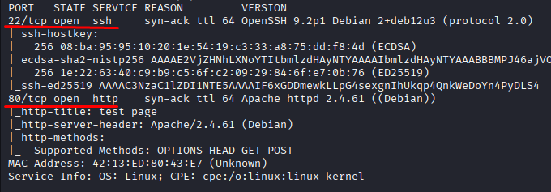
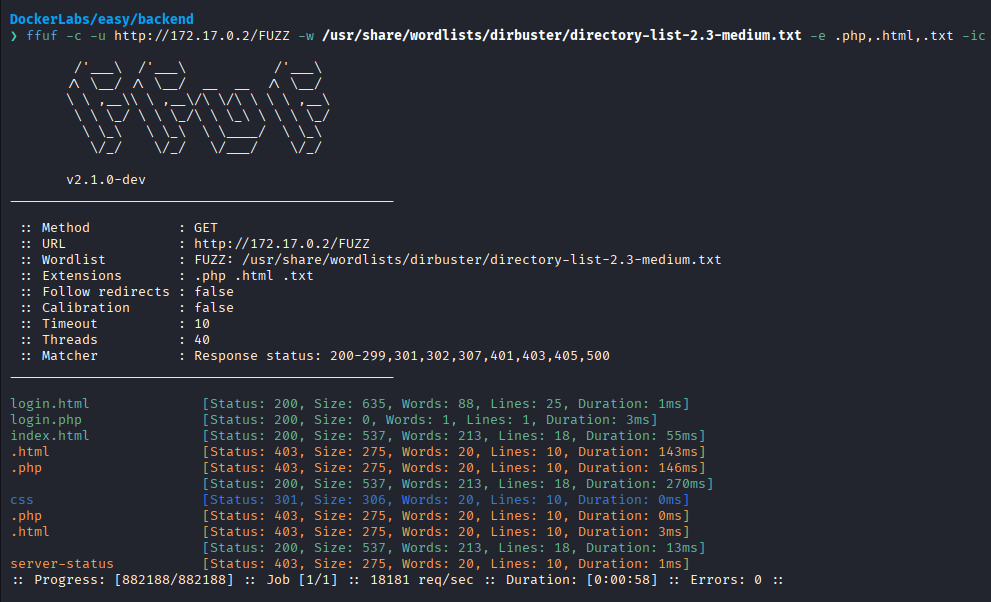
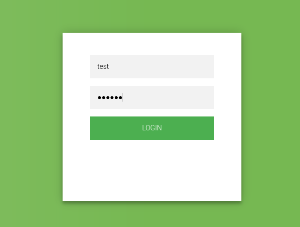
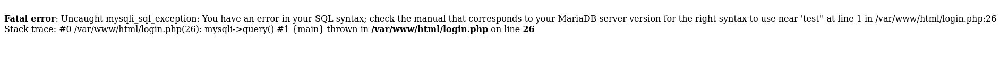
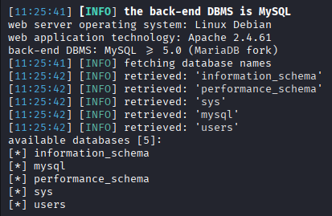
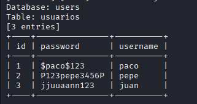
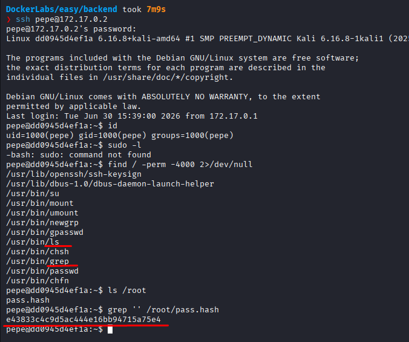
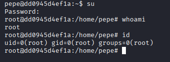

# Backend

Difficulty: Easy

Link: https://dockerlabs.es/

## Summary

- [Introduction](#introduction)
- [Exploitation](#exploitation)
- [Impact](#impact)

## Introduction

The objective of this lab is to exploit a web application vulnerable to SQL Injection in order to retrieve credentials stored in the database and use them to gain SSH access to the target machine. From there, it is possible to identify misconfigured permissions that allow access to a sensitive file containing a password hash, ultimately leading to root privileges.

## Exploitation

After starting the lab on Kali Linux and obtaining access to the target IP, the first step was to perform an initial reconnaissance using Nmap.

```bash
sudo nmap -p- -sV -sC -T3 -vvv -Pn 172.17.0.2 -oN escaneo
```

The scan was configured with the following options:

* `-p-` to scan all TCP ports.
* `-sV` to detect service versions.
* `-sC` to run the default enumeration scripts.
* `-T3` to use the default timing template.
* `-vvv` to increase verbosity.
* `-Pn` to assume the host is up and skip host discovery.

Once the scan completed, the following open ports were identified:

* 22/tcp - SSH
* 80/tcp - HTTP



Since port 80 was hosting a web application, the analysis started there. Before accessing the website, a fuzzing scan was performed to discover additional endpoints. Although a few paths were found, none exposed functionality beyond what was already available on the main page or provided anything useful for the exploitation.



Upon accessing the site, it appeared to be an application under construction, containing only a login button that redirected to a simple authentication page with username and password fields.



The first step was to understand how the application handled authentication requests. An initial test consisted of using a classic SQL Injection payload.

```text
Username: admin
Password: 'or'1'='1
```

This payload did not bypass the authentication.


Next, the username `admin'` was submitted. This time, the application returned a stack trace along with an SQL syntax error. This behavior indicated that user input was being incorporated directly into an SQL query without proper sanitization, suggesting that the login form was vulnerable to SQL Injection.



Based on this finding, SQLMap was used to automate the exploitation.

```bash
sqlmap -u "http://172.17.0.2/login.php" \
  --data="username=test&password=test" \
  --batch \
  --risk=3 \
  --level=5 \
  --dbs
```

The `--dbs` option was first used to enumerate the available databases. After identifying the `users` database, the command was modified to list its tables using `-D users --tables`. It was found that the database contained a single users table. Finally, the `--dump` option was used to extract the stored user information.





With the recovered credentials, the exposed SSH service was tested. Among the available users, only the `pepe` account allowed successful authentication.

After gaining access to the system, the user's permissions were inspected. It was observed that the account had permission to execute `ls` and `grep`. Using these permissions, the contents of the `/root` directory were listed, revealing a file containing a password hash.

```bash
ls /root
```

The file was then read using `grep`.

```bash
grep '' /root/pass.hash
```

The extracted hash was submitted to a hash cracking tool, revealing the password for the `admin` user. With the recovered password, it was only necessary to execute the following command to switch to the root account and obtain full administrative privileges.

```bash
su
```





## Impact

This vulnerability allows an attacker to extract sensitive information from the database through SQL Injection, including valid user credentials that can be used to gain SSH access to the system. Once authenticated, improperly assigned permissions enable access to sensitive files owned by root, allowing administrative credentials to be recovered and ultimately leading to full compromise of the target machine.
