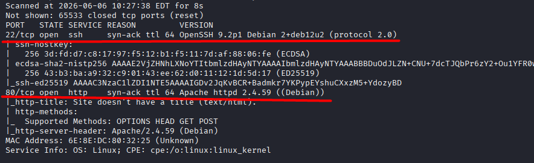
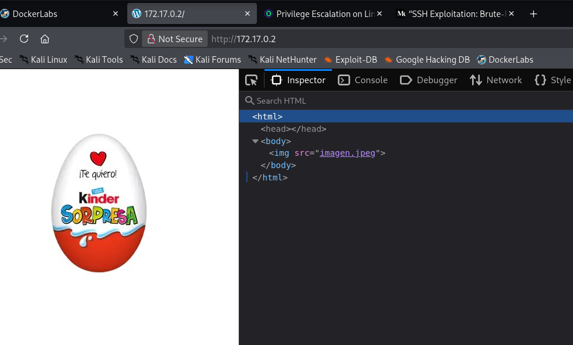
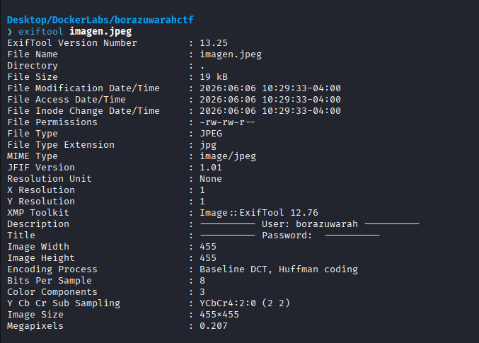
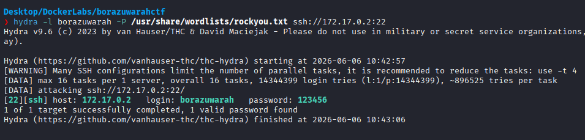
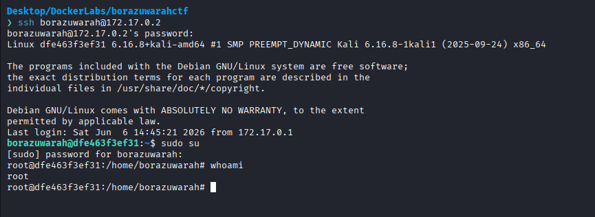

# BorazuwarahCTF

Difficulty: Very easy

Link: https://dockerlabs.es/

## Summary

- [Introduction](#introduction)
- [Exploitation](#exploitation)
- [Impact](#impact)

## Introduction

The objective of this lab is to demonstrate how a simple information disclosure can end up compromising an entire system. During the enumeration phase, it was possible to identify a user through the metadata of an image hosted on the web application. From there, access to the SSH service was obtained and, consequently, full control of the machine.

## Exploitation

Once the lab was running on Kali Linux and I had access to the target IP, I started by performing an initial reconnaissance of the machine using Nmap.

```bash
sudo nmap -p- -sV -sC -T3 -n -vvv -Pn 172.17.0.2 -oN escaneo
```

The parameters used were:

* `-p-` to scan all TCP ports.
* `-sV` to identify service versions.
* `-sC` to run the default enumeration scripts.
* `-T3` to use a moderate timing template.
* `-n` to avoid DNS resolution.
* `-vvv` to increase verbosity.
* `-Pn` to assume the host is up and skip host discovery.

After the scan finished, I found the following open ports:

```text
22/tcp - ssh - OpenSSH 9.2p1 Debian 12
80/tcp - http - Apache httpd 2.4.59 (Debian)
```



Since port 80 was available, I decided to start there and see if I could find any initial clues. Upon accessing the website, I was greeted by nothing more than a picture of a Kinder Surprise egg. Quite tempting, to be honest haha.

Curious to see if there was anything hidden behind it, I started browsing through the DevTools and inspecting the page source. However, the HTML was extremely basic, with no comments, hidden functionality, or anything particularly interesting. I also found nothing relevant in the HTTP requests made by the application.



Since there was nothing useful in the page itself, I decided to download the image and investigate its metadata. Labs often hide interesting information inside seemingly harmless files, so I tested that theory using ExifTool.

```bash
exiftool imagen.jpg
```

While analyzing the metadata, I found a username stored inside the image. Since SSH was exposed, this immediately caught my attention as it could potentially be a valid system user.



With a possible username in hand, the next step was to discover its password. As there were no other clues available, I used Hydra together with the rockyou wordlist to perform a brute-force attack against the SSH service.

A few seconds after launching the attack, Hydra successfully found the correct password for the previously identified user.



With valid credentials available, I simply connected to the machine through SSH using the discovered username and password.

After gaining access, I executed:

```bash
sudo su
```



Since the user had sufficient privileges to escalate, I obtained root access and successfully completed the lab.

## Impact

Exposed metadata can provide valuable information to an attacker during the enumeration phase. In this scenario, a simple username stored inside an image was enough to guide a brute-force attack against the SSH service, ultimately leading to valid credentials being obtained and the complete compromise of the system.
