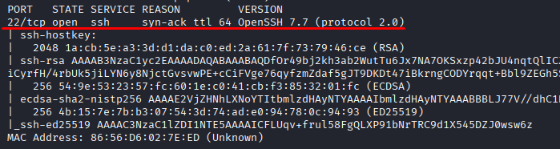
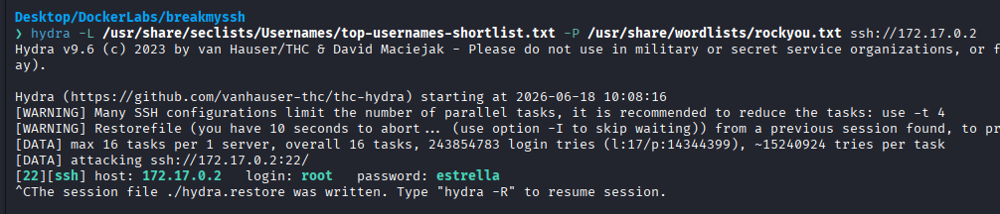
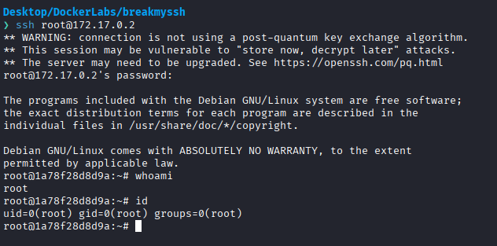

# BreakMySSH

Difficulty: Very easy

Link: https://dockerlabs.es/

## Summary

- [Introduction](#introduction)
- [Exploitation](#exploitation)
- [Impact](#impact)

## Introduction

The objective of this lab is to gain access to the target system through an exposed SSH service. This scenario demonstrates how weak or predictable credentials can lead to the direct compromise of a server when no effective protections are in place to restrict authentication attempts.

## Exploitation

After deploying the lab and identifying the target IP address, the first step was to perform an initial enumeration using Nmap to identify available services and potential attack vectors.

```bash
sudo nmap -p- -sV -sC -T3 -vvv -Pn 172.17.0.2 -oN escaneo
```

The selected parameters allow scanning all TCP ports, identifying service versions, running default enumeration scripts, increasing verbosity, and skipping the host discovery phase.

Once the scan was completed, only a single exposed service was identified:

```text
22/tcp  ssh   OpenSSH 7.7
```



Since there were no additional attack surfaces available and no clues regarding possible system users, the chosen approach was to perform a brute-force attack against the SSH service.

To achieve this, the `top-usernames-shortlist.txt` wordlist from SecLists was used to identify valid usernames, while the `rockyou.txt` wordlist was used to test potential passwords. The goal was to determine whether the server was using common or weak credentials.

After launching the attack with Hydra, valid credentials were discovered in a short amount of time. The results revealed direct access to the **root** account, providing full authentication to the SSH service.



With valid credentials obtained, the final step was simply to connect to the server via SSH and complete the lab.



## Impact

This vulnerability highlights the risk of using weak or predictable credentials on services exposed to a network. An attacker can gain unauthorized access through automated brute-force attacks and, when the compromised account has administrative privileges, immediately obtain full control of the server.
