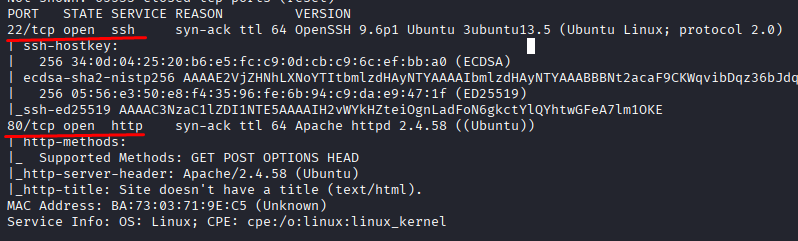
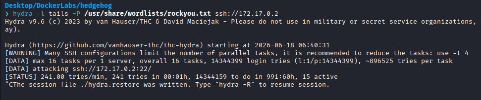
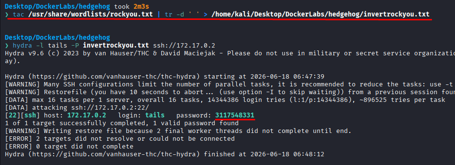
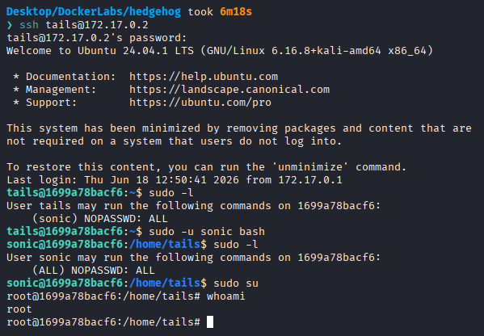

# HedgeHog

Difficulty: Very easy

Link: https://dockerlabs.es/

## Summary

- [Introduction](#introduction)
- [Exploitation](#exploitation)
- [Impact](#impact)

## Introduction

The objective of this lab is to identify an initial access vector through the services exposed by the target and perform privilege escalation until obtaining root access. During the exploitation process, it was possible to leverage information gathered from the web application to conduct a brute-force attack against an exposed service and subsequently abuse misconfigured sudo permissions to fully compromise the system.

## Exploitation

After deploying the lab and identifying the target IP address, the first step was to perform an initial enumeration using Nmap to identify available services and potential attack vectors.

```bash
sudo nmap -p- -sV -sC -T3 -vvv -Pn 172.17.0.2 -oN escaneo
```

The selected parameters allow scanning all TCP ports, identifying service versions, running default enumeration scripts, increasing verbosity, and skipping host discovery by assuming the target is alive.

Once the scan was completed, the following open ports were identified:

```text
22/tcp  ssh   OpenSSH 9.6p1 Ubuntu 3ubuntu13.5
80/tcp  http  Apache httpd 2.4.58 ((Ubuntu))
```



Since port 80 was hosting a web application, the investigation started there, as web services often provide useful information for further exploitation. Upon accessing the page, only the text **"tails"** was displayed, with no additional information available.

Additional analysis was performed using Burp Suite to inspect the requests and Gobuster to search for hidden directories and endpoints. However, neither approach revealed any useful findings.

Because **"tails"** was the only clue available, the hypothesis was that it could correspond to a valid system user. Based on this assumption, a brute-force attack was launched using Hydra in an attempt to discover the associated password.



During the initial attempt, the password was not found quickly due to the size of the `rockyou.txt` wordlist, which contains a very large number of entries. To optimize the process, an inverted version of the wordlist was used so that passwords located near the end of the file would be tested first.

```bash
tac rockyou.txt | tr -d ' '
```

In addition to reversing the order of the entries, the command removes spaces from the file. After a few seconds, Hydra successfully identified the password associated with the **tails** user.



With valid credentials obtained, the next step was to access the system through SSH. After logging in successfully, the available sudo privileges were checked using:

```bash
sudo -l
```

The output revealed that the **tails** user was allowed to execute a Bash shell as the **sonic** user without providing a password. This allowed switching to that user context with:

```bash
sudo -u sonic bash
```

Once operating as **sonic**, another privilege review showed that this user had administrative privileges without requiring authentication. As a result, obtaining root access was straightforward:

```bash
sudo su
```

This resulted in full root access to the target system.



## Impact

This exploitation demonstrates how seemingly insignificant information exposed through a web application can serve as a starting point for a full system compromise. The combination of weak credentials vulnerable to brute-force attacks and improperly configured sudo permissions allowed an attacker to escalate from initial access to full administrative privileges, resulting in complete control of the server.
