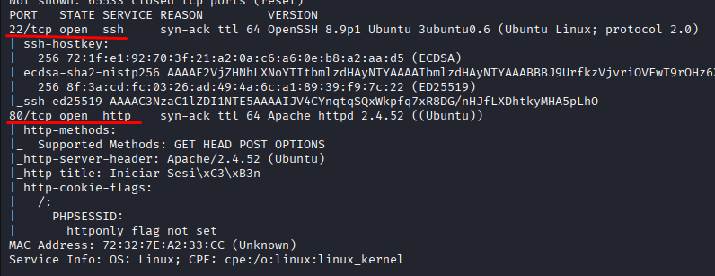
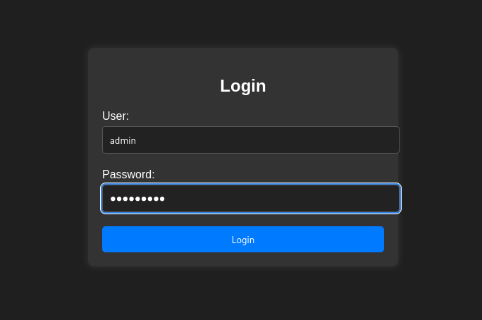
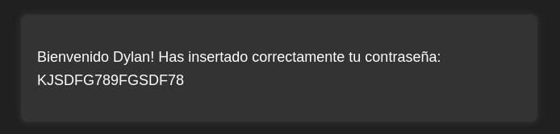
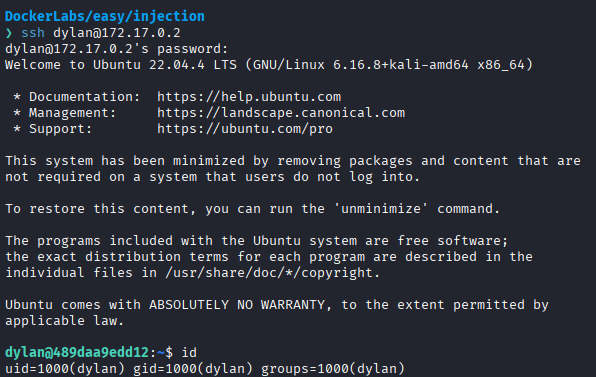
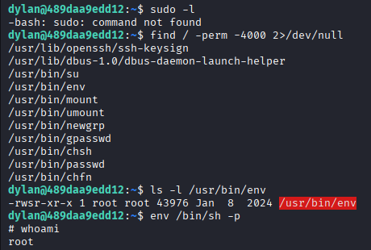

# Injection

Difficulty: Easy

Link: https://dockerlabs.es/

## Summary

- [Introduction](#introduction)
- [Exploitation](#exploitation)
- [Impact](#impact)

## Introduction

The objective of this lab is to exploit a SQL Injection vulnerability in a web application to gain unauthorized access to the system. Once authenticated, the exposed credentials can be reused to access the SSH service and then identify a path to escalate privileges to the root user.

## Exploitation

After starting the lab on Kali Linux and identifying the target machine's IP address, the first step was to perform an initial reconnaissance using Nmap to enumerate open ports and identify the available services.

```bash
sudo nmap -p- -sV -sC -T3 -vvv -Pn 172.17.0.2 -oN escaneo
```

The parameters used were:

* `-p-` to scan all TCP ports.
* `-sV` to detect service versions.
* `-sC` to run the default enumeration scripts.
* `-T3` to use the default timing template.
* `-vvv` to increase verbosity.
* `-Pn` to assume the host is up and skip host discovery.

The scan identified the following services:

```text
22/tcp  ssh (OpenSSH 8.9p1 Ubuntu 3ubuntu0.6)
80/tcp  http (Apache)
```



Since a web service was available, the assessment started by analyzing port 80. Accessing the application revealed a simple login page containing only a username and password form. A directory enumeration was also performed using **ffuf**, but the discovered paths did not provide anything relevant for the exploitation, so the focus returned to the authentication form.



Although this type of vulnerability is relatively uncommon in modern login forms, a classic SQL Injection payload was tested using the `admin` username.

```text
Username: admin
Password: 'or'1'='1
```

The authentication succeeded, confirming that the login form was vulnerable to SQL Injection.



After logging in, the user panel exposed a username and password. Since the SSH service was available, the hypothesis was that these credentials could also be valid for remote authentication.

Using the discovered credentials to connect through SSH on port 22 was successful.



After gaining access to the system, a basic privilege enumeration was performed. The user did not have sudo permissions, but the `env` binary was available and could potentially be used for privilege escalation.

To verify its permissions, the following command was executed:

```bash
ls -l /usr/bin/env
```

After confirming its availability, a privileged shell was obtained by running:

```bash
env /bin/sh -p
```



The command spawned a root shell, successfully completing the lab.

## Impact

This lab demonstrates how a SQL Injection vulnerability can become the initial entry point for a complete system compromise. The flaw allowed unauthorized access to the application, exposed credentials that could be reused to access the SSH service, and ultimately enabled privilege escalation through the `env` binary, resulting in full control of the target system.
