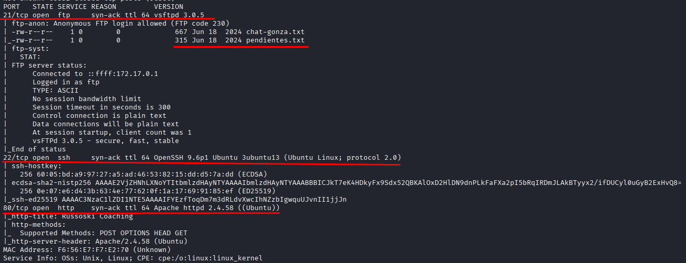
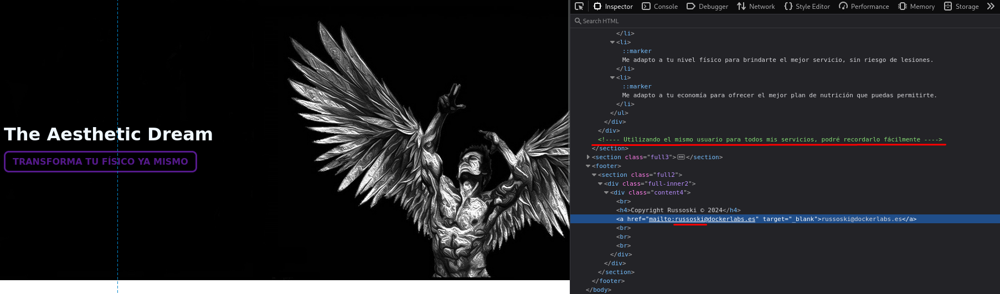
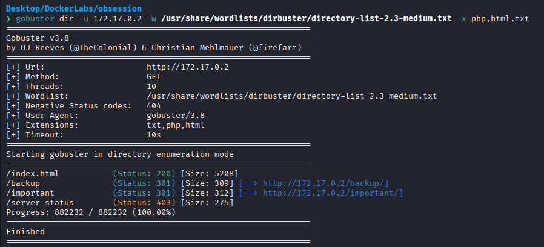
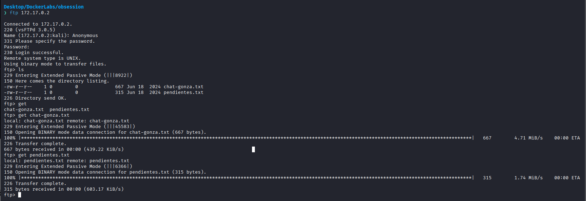
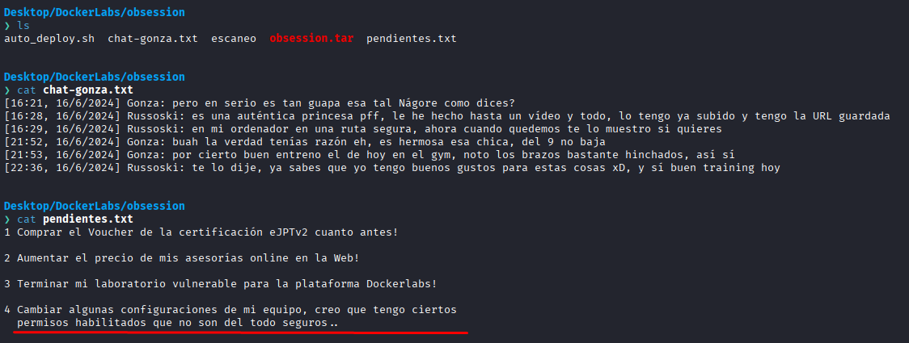
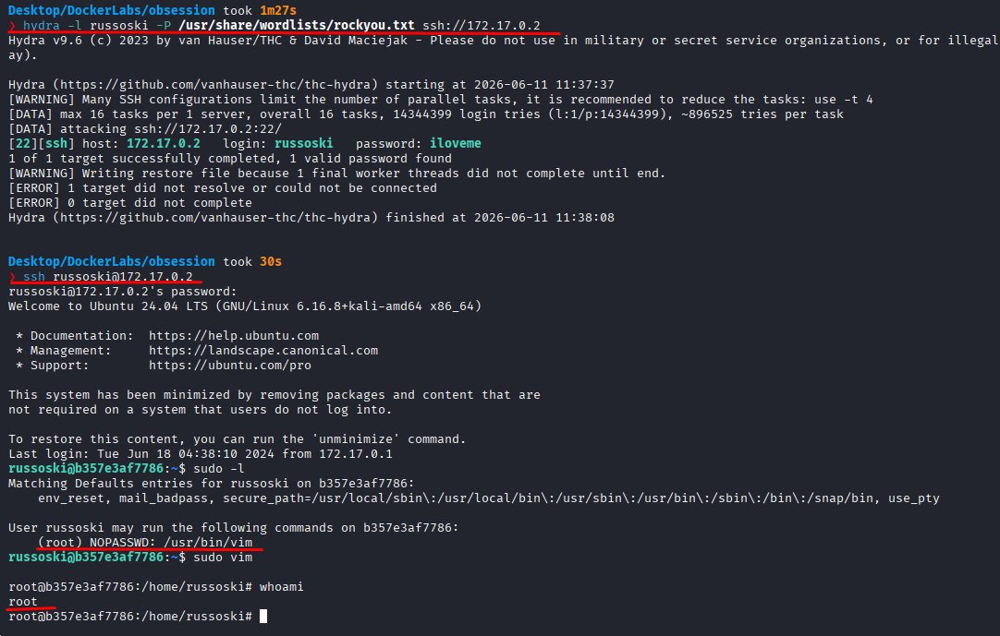

# Obssesion

Difficulty: Very easy

Link: https://dockerlabs.es/

## Summary

- [Introduction](#introduction)
- [Exploitation](#exploitation)
- [Impact](#impact)

## Introduction

The goal of this lab is to compromise a machine by enumerating its exposed services. During the assessment, information exposed through both the web application and the FTP service reveals important details about the user being used on the system, making it possible to gain SSH access and later escalate privileges to root through an insecure sudo configuration.

## Exploitation

After deploying the lab on Kali Linux and identifying the target machine's IP address, I started by performing an initial Nmap scan.

```bash
sudo nmap -p- -sV -sC -T3 -n -vvv -Pn 172.17.0.2 -oN escaneo
```

The parameters used were intended to perform a complete enumeration of the target:

* `-p-`: scans all available TCP ports.
* `-sV`: identifies the versions of discovered services.
* `-sC`: runs Nmap's default enumeration scripts.
* `-T3`: uses a moderate level of aggressiveness during the scan.
* `-vvv`: increases the verbosity level of the output.
* `-Pn`: assumes the host is up and skips the host discovery phase.

After the scan, I found the following open ports:

```text
21/tcp  ftp   vsftpd 3.0.5
22/tcp  ssh   OpenSSH 9.6p1 Ubuntu 3ubuntu13
80/tcp  http  Apache httpd 2.4.58 ((Ubuntu))
```



Since port 80 was available, I decided to start with the web application, as this type of service often provides useful information during enumeration. The page itself was very simple, but while reviewing the HTML source code I found an interesting comment stating that the same user was being used across all services to make it easier to remember. Along with that, there was also an email address, which served as a possible clue about the machine's user.



With that information in hand, I decided to continue the web enumeration to see if there was any other interesting content available. During this process, I found two endpoints. 



The first one, called `important`, only contained a manifesto and nothing useful for the exploitation. The second endpoint, `backup`, returned the following message:

```text
Usuario para todos mis servicios: russoski (cambiar pronto!)
```

This message confirmed the username being used across the machine's services.

Next, I moved on to analyzing port 21. After accessing the FTP service, I found two available files. 




Once downloaded, I verified that the first one contained only a chat history, while the second one was a to-do list. Among the notes in that file, there was once again a reference to the need to change the user-related configuration, reinforcing what had already been discovered earlier.



At this point, I already had the victim's username, so I decided to test SSH access using Hydra against port 22. The result was successful, and I was able to discover the user's password and gain access to the system.



Once inside the machine, the first thing I did was check the available sudo permissions.

```bash
sudo -l
```

The output showed that it was possible to execute `vim` with sudo. Knowing that, I ran `sudo vim` and, from inside the editor, used the following command:

```vim
:!/bin/bash
```

Since Vim was being executed with elevated privileges, the spawned shell inherited those permissions, giving me root access and completing the lab.

As an additional note, it is possible to find the video mentioned in the chat history inside the `/home` directory using: 'cd /root && ls'


## Impact

The exposure of information across different services made it possible to identify a valid system user and facilitated SSH access. This lab demonstrates well how small oversights can accumulate and create a complete path to compromise. Sensitive information exposed through accessible endpoints, such as usernames used across the machine's services, can provide exactly what an attacker needs during the enumeration phase. Additionally, leaving insecure configurations to be fixed "later" represents a significant risk, since many compromises occur precisely during that period of postponement. After authentication, the ability to execute Vim with sudo made it possible to spawn a privileged shell and take full control of the machine, demonstrating how the failure to promptly apply security measures can ultimately lead to complete system compromise.
