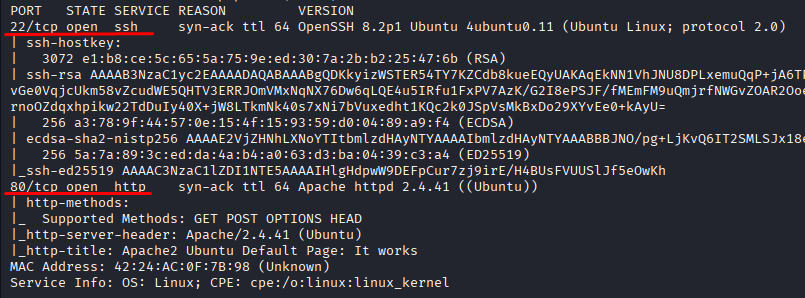
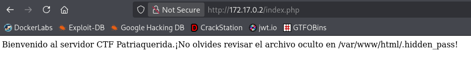
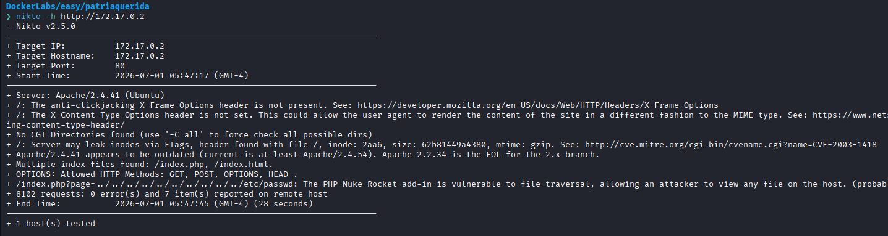
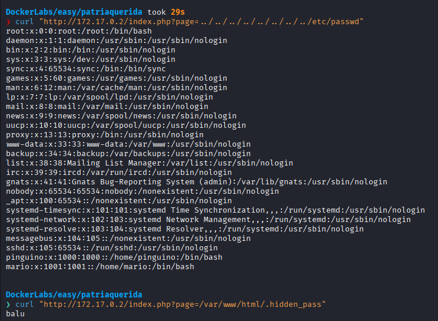
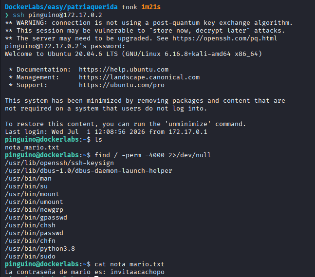
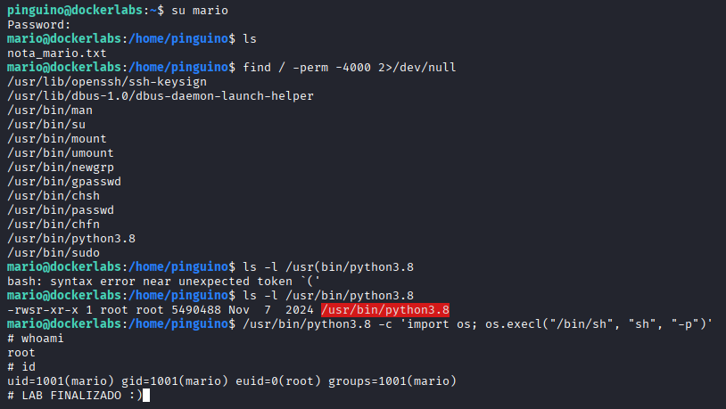

# Patria Querida

Difficulty: Easy

Link: [https://dockerlabs.es/](https://dockerlabs.es/)

## Summary

- [Introduction](#introduction)
- [Exploitation](#exploitation)
- [Impact](#impact)

## Introduction

The objective of this lab is to exploit a File Traversal vulnerability in a web application to obtain sensitive system information, recover valid credentials, and gain SSH access to the target machine. From there, it is possible to identify insecure permissions that allow privilege escalation to the root user.

## Exploitation

After starting the lab on Kali Linux and obtaining access to the target IP, the first step was to perform an initial reconnaissance using Nmap.

```bash
sudo nmap -p- -sV -sC -T3 -vvv -Pn 172.17.0.2 -oN escaneo
```

The scan was configured with the following options:

* `-p-` to scan all TCP ports.
* `-sV` to detect service versions.
* `-sC` to run the default enumeration scripts.
* `-T3` to use the default timing template.
* `-vvv` to increase verbosity.
* `-Pn` to assume the host is up and skip host discovery.

Once the scan completed, the following open ports were identified:

* 22/tcp - SSH
* 80/tcp - HTTP



Since port 80 was hosting a web application, the analysis started there. Before accessing the website, a fuzzing scan was performed to discover additional endpoints. During this enumeration, an endpoint leading to `index.php` was found, displaying a message reminding users not to forget a hidden file located within a directory.



Next, **Nikto** was used to assess the web server. Nikto is a web vulnerability scanner capable of detecting known vulnerabilities and insecure configurations. The scan revealed that the application was vulnerable to File Traversal. Based on this finding, the following endpoint was tested:

```text
/index.php?page=../../../../../../../../etc/passwd
```



The request returned the contents of the `/etc/passwd` file, making it possible to identify the users present on the system. Among them, `pingüino` and `mario` stood out as non-default users, making them likely candidates for SSH access.

With this information in mind, a request was sent using `curl` to retrieve the hidden file referenced earlier. Its contents revealed the word **balu**, suggesting it could be the password for one of the identified users.



An SSH login was then attempted using the `pingüino` account with the password `balu`, successfully granting access to the system.

Once inside, a basic enumeration of the user's home directory was performed. A file named `nota_mario.txt` was found containing the password for the `mario` user.

Next, the available permissions were reviewed, and it was confirmed that the `su` command could be used. Although it was already possible to continue the privilege escalation from the `pingüino` account, the decision was made to switch to the `mario` user using the recovered credentials.



After logging in as `mario`, another privilege enumeration revealed a Python binary that stood out. Running `ls -l` showed that the binary was associated with the `root` user.

Using GTFOBins, a technique was found to spawn a privileged shell through this Python binary. After executing the corresponding payload, root privileges were obtained, completing the lab.



## Impact

This attack demonstrates how a File Traversal vulnerability can expose sensitive system information, allowing an attacker to identify valid users and recover credentials for remote access. When combined with insecure permissions on privileged binaries, this leads to full system compromise by allowing privilege escalation to the root user.
