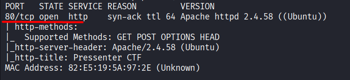
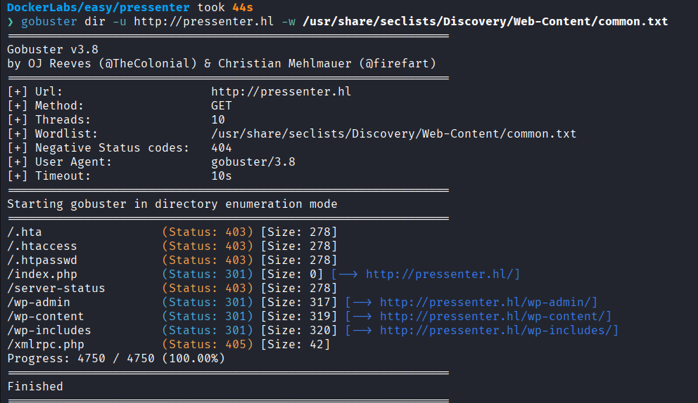
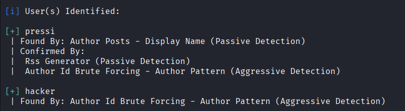
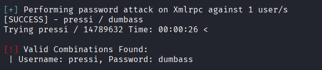
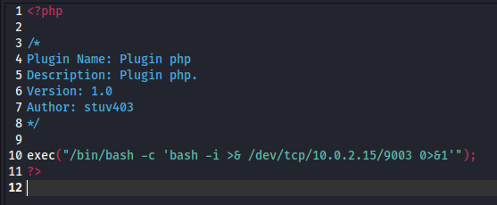
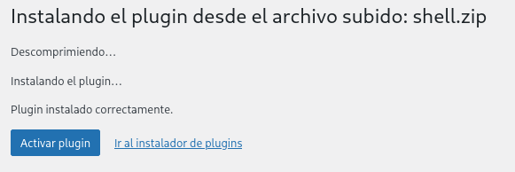
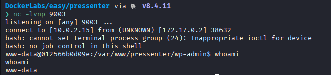
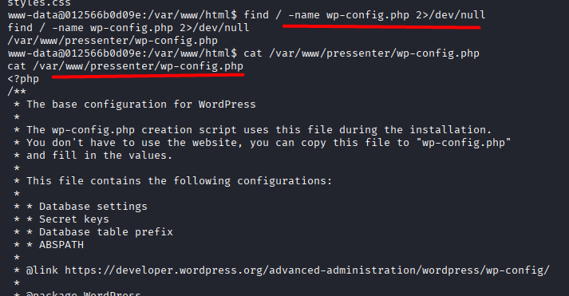
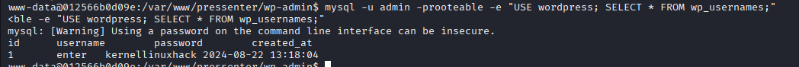
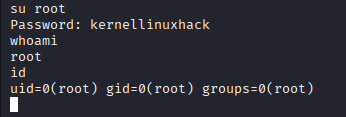

# Pressenter

Difficulty: Easy

Link: [https://dockerlabs.es/](https://dockerlabs.es/)

## Summary

- [Introduction](#introduction)
- [Exploitation](#exploitation)
- [Impact](#impact)

## Introduction

The objective of this lab is to exploit a WordPress application exposed on the web until full access to the underlying system is obtained. Throughout the assessment, enumeration techniques, user discovery, credential brute-forcing, and abuse of WordPress administrative functionality are used to achieve remote code execution on the server.

## Exploitation

After starting the lab and identifying the target IP address, the first step was to perform reconnaissance with Nmap to identify open ports and exposed services.

```bash
sudo nmap -p- -sV -sC -T3 -vvv -Pn 172.17.0.2 -oN escaneo
```

The selected options scan all TCP ports (`-p-`), detect service versions (`-sV`), run the default enumeration scripts (`-sC`), use the default timing template (`-T3`), display verbose output (`-vvv`), and skip host discovery by assuming the target is online (`-Pn`).

Once the scan completed, only port **80/TCP** was found open, indicating that the web application would be the primary attack surface.



After accessing the website, the HTML looked unusual and somewhat confusing. Inspecting the page source revealed a reference to the domain `http://pressenter.hl`. Since the domain could not be resolved locally, it was added to `/etc/hosts`, and the page was reloaded to access the application correctly.

A Gobuster scan was then performed to enumerate additional endpoints and directories. During this process, the `wp-admin` endpoint was discovered, confirming that the application was running WordPress.



With WordPress identified, WPScan was used to enumerate valid users. The scan revealed two usernames: `pressi` and `hacker`.



A brute-force attack was then performed with WPScan using the `rockyou.txt` wordlist. The attack successfully recovered valid credentials for the user `pressi`, whose password was `dumbass`.



After logging into the WordPress administrative panel, the plugin installation functionality was used to achieve remote code execution. Before uploading the plugin, a PHP file containing a reverse shell was created and then uploaded through the WordPress interface.





Before triggering the uploaded payload, a listener was started on the Kali machine using port `9003`. Once the reverse shell was executed, a connection was successfully established, providing interactive access to the target system.



With shell access established, the next step was to locate the WordPress configuration file in order to retrieve the database credentials used by the application.



Using those credentials, the database was accessed and a series of SQL queries was executed to enumerate additional WordPress users. During this process, the user `enter` was identified.



After spending some time looking for a way to escalate privileges, the password `dumbass` was tested against the `enter` account. The password reuse proved successful, allowing access as `root` and completing the lab.



## Impact

This vulnerability demonstrates how weak credentials, password reuse, and administrative access to a WordPress installation can lead to full system compromise. Once administrative access was obtained, it was possible to execute arbitrary code on the server, recover sensitive credentials from the application's configuration, and reuse discovered credentials to ultimately gain `root` access.
