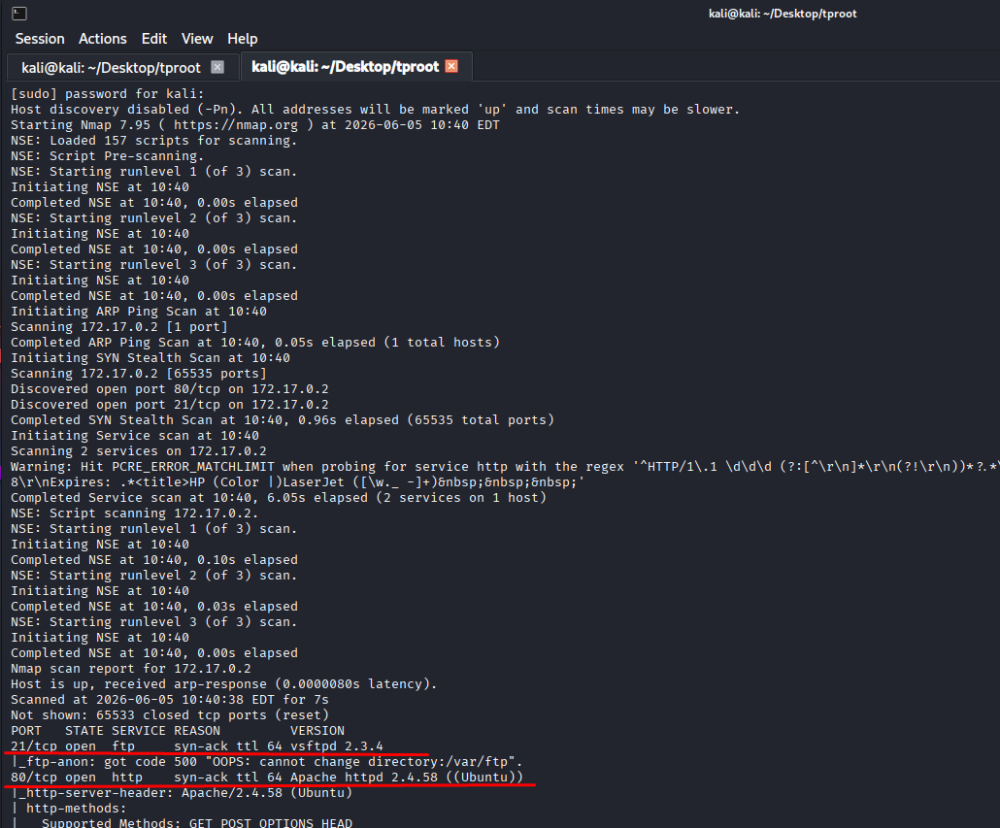
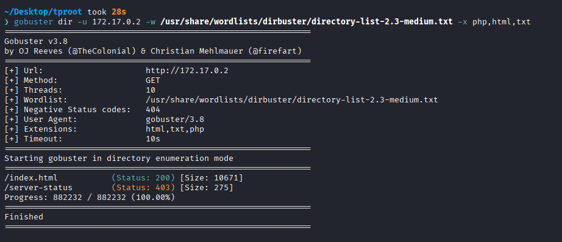
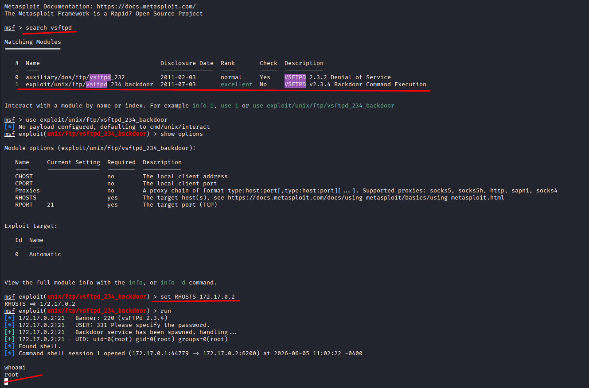

# Tproot

Difficulty: Very easy

Link: https://dockerlabs.es/

## Summary

- [Introduction](#introduction)
- [Exploitation](#exploitation)
- [Impact](#impact)

## Introduction

The objective of this lab is to identify and exploit a vulnerable service exposed on the target machine. During enumeration, it was possible to find an FTP service running vsftpd version 2.3.4, which is known for containing a backdoor in compromised releases of the software. Exploiting this vulnerability allows direct remote access to the system.

## Exploitation

With the machine running and access to the target IP available, I started by performing an Nmap scan to identify open ports and running services.

```bash id="a2x9lq"
sudo nmap -p- -sV -sC -T3 -n -vvv -Pn 172.17.0.2 -oN escaneo
```

The parameters used were intended to perform a complete enumeration of the target:

* `-p-`: scans all available TCP ports.
* `-sV`: identifies the versions of discovered services.
* `-sC`: runs Nmap's default enumeration scripts.
* `-T3`: uses a moderate level of aggressiveness during the scan.
* `-n`: disables DNS resolution to speed up the process.
* `-vvv`: increases the verbosity level of the output.
* `-Pn`: assumes the host is up and skips the host discovery phase.

After the scan completed, I found the following open ports:

```text id="g1z4np"
21/tcp - vsftpd 2.3.4
80/tcp - Apache http (Ubuntu)
```



Since port 80 was available, I decided to start with the web application to see if there were any interesting functionalities or hidden directories.

To do that, I ran Gobuster looking for resources that could help during enumeration.



The results only showed the main page (`index`) and the `server-status` directory, which returned a forbidden response. Since everything appeared to be standard Apache content and I couldn't find anything useful to move forward, I shifted my focus to the FTP service.

After checking the version identified by Nmap, a quick search revealed that `vsftpd 2.3.4` contains a well-known backdoor:

```text id="q7jw3m"
CVE-2011-2523

vsftpd 2.3.4 downloaded between 20110630 and 20110703 contains a backdoor which opens a shell on port 6200/tcp.
```

This vulnerability affects compromised versions of the service distributed during a short period of time and allows a remote shell to be opened through port `6200/tcp`.

Knowing this, I used Metasploit to exploit the vulnerability.

After selecting the appropriate module, I configured the target with:

```text id="m6s2te"
set RHOSTS <ip>
run
```

A few seconds after running the module, I got a positive result. The backdoor was successfully triggered and a shell was opened with `root` privileges, giving full control over the machine and completing the lab.



## Impact

CVE-2011-2523 allows remote command execution through a backdoor present in compromised versions of vsftpd 2.3.4. As demonstrated in the lab, an attacker can gain direct access to the system with root privileges, completely compromising the confidentiality, integrity, and availability of the affected environment.
