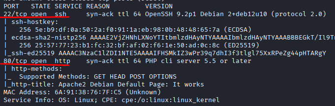
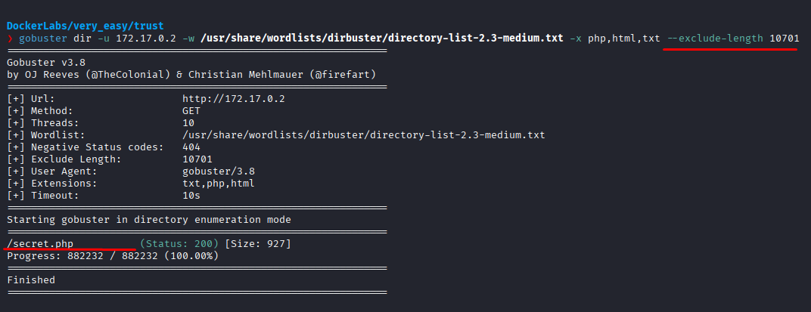
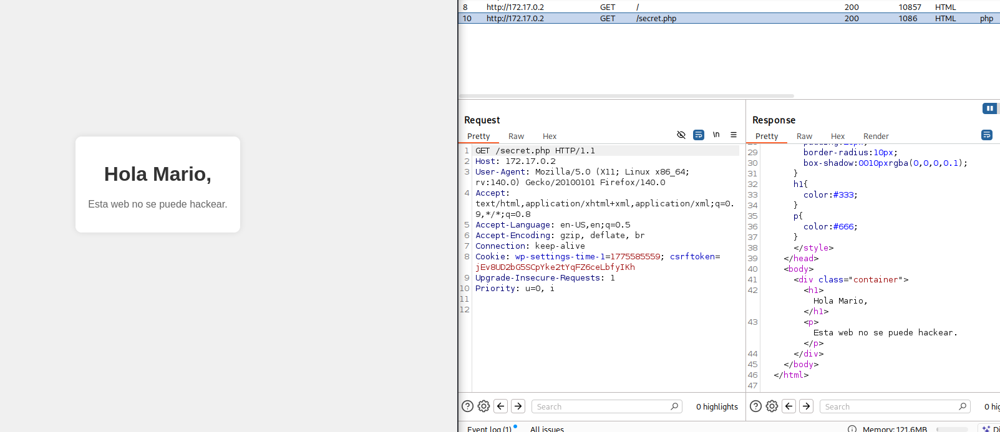
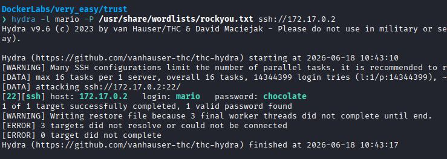
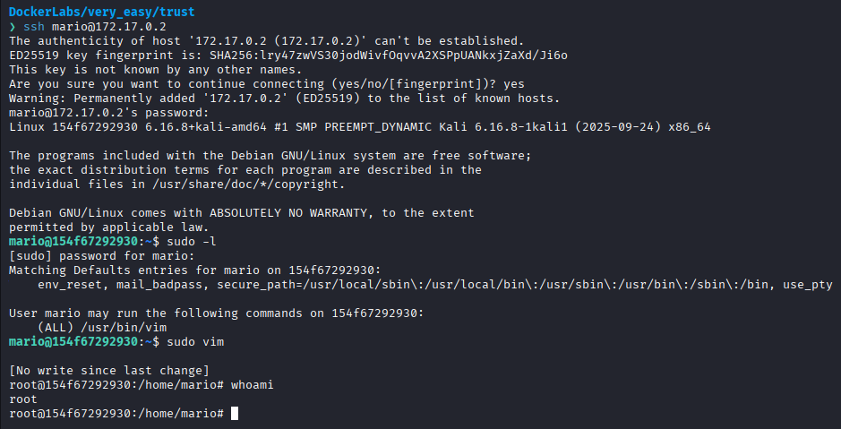

# Trust

Difficulty: Very easy

Link: https://dockerlabs.es/

## Summary

- [Introduction](#introduction)
- [Exploitation](#exploitation)
- [Impact](#impact)

## Introduction

The objective of this lab is to identify information exposed through a web application and use it to gain initial access to the target system. The exercise demonstrates how seemingly minor information disclosure can facilitate attacks against exposed services and ultimately lead to privilege escalation through misconfigured sudo permissions.

## Exploitation

After deploying the lab and identifying the target IP address, the first step was to perform an initial enumeration using Nmap to identify available services and potential attack vectors.

```bash
sudo nmap -p- -sV -sC -T3 -vvv -Pn 172.17.0.2 -oN escaneo
```

The selected parameters allow scanning all TCP ports, identifying service versions, running default enumeration scripts, increasing verbosity, and skipping the host discovery phase by assuming the target is alive.

Once the scan was completed, the following services were identified:

```text
22/tcp - ssh (OpenSSH 9.2p1 Debian 2+deb12u10)
80/tcp - http (PHP CLI Server)
```



Since port 80 was hosting a web application, the investigation continued there. Upon accessing the page, only content resembling a default Apache page was displayed, providing no useful information for further exploitation.

With no obvious clues available, the next step was to perform directory enumeration using Gobuster. During the process, a wildcard behavior was identified, where any endpoint returned the same response. This prevented conventional enumeration because it generated numerous false positives.

To overcome this issue, the size of the default page was identified and a filter was applied to exclude responses with that length using:

```bash
--exclude-length 10701
```

After applying the filter and running the enumeration again, the following endpoint was discovered:

```text
/secret.php
```



Accessing the page revealed the following message:

```text
Hola Mario, esa web no se puede hackear
```

An analysis of both the HTTP response and the HTML source did not reveal any additional useful information. However, the name **Mario** stood out as a potential valid username on the system.



Based on this hypothesis, a brute-force attack was performed using Hydra, specifying **Mario** as the username and using the `rockyou.txt` wordlist to test possible passwords.

After a few seconds, valid credentials for the identified user were successfully discovered.



With valid credentials obtained, it was possible to authenticate to the exposed SSH service. Once logged in, the user's privileges were reviewed, revealing permission to execute Vim through sudo.

The escalation process began by launching Vim with elevated privileges:

```bash
sudo vim
```

After the editor was opened, Vim's command execution feature was used:

```vim
:!/bin/bash
```

Since Vim was running with elevated privileges, the command spawned a root shell, providing full control over the server.



## Impact

This vulnerability demonstrates how a simple information disclosure within a web application can assist an attacker in identifying valid users and conducting brute-force attacks against exposed services. When combined with excessive sudo permissions on applications such as Vim, an authenticated attacker can escalate privileges to root and fully compromise the target system.
