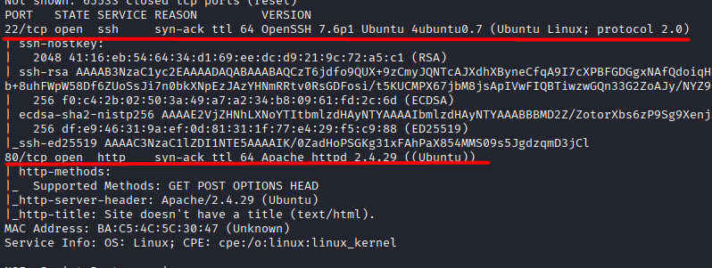
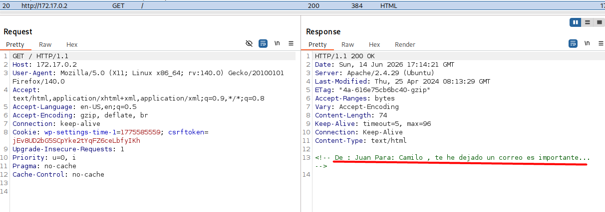
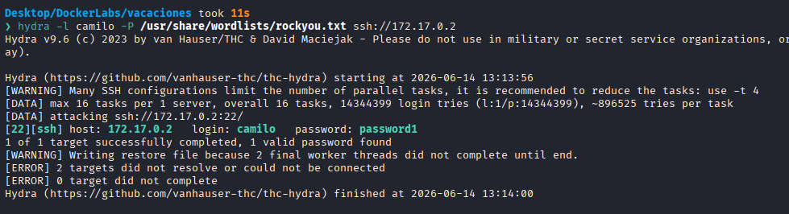
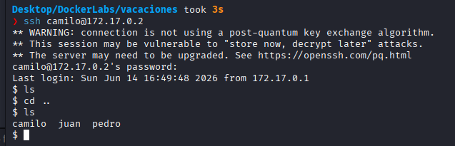
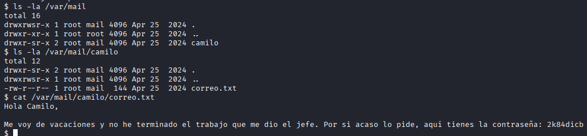
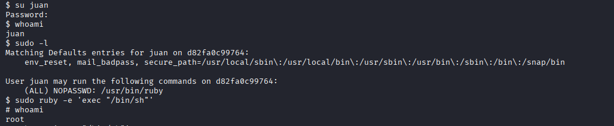

# Vacaciones

Difficulty: Very easy

Link: https://dockerlabs.es/

## Summary

- [Introduction](#introduction)
- [Exploitation](#exploitation)
- [Impact](#impact)

## Introduction

The objective of this lab is to explore an environment exposing multiple services and identify sensitive information that can be leveraged for privilege escalation. During the assessment, it is possible to discover credentials exposed through mail files stored on the system, as well as an insecure sudo configuration that allows Ruby to be executed with elevated privileges, ultimately leading to full system compromise.

## Exploitation

After deploying the lab and obtaining access to the target IP address, the first step was to perform a full enumeration of the available ports and services using Nmap.

```bash
sudo nmap -p- -sV -sC -T3 -vvv -Pn 172.17.0.2 -oN escaneo
```

The selected parameters allowed a complete port scan, service version detection, execution of default enumeration scripts, and bypassing the host discovery phase.

Once the scan was completed, two open ports were identified:

```text
22/tcp  ssh   OpenSSH 7.6p1 Ubuntu 4ubuntu0.7
80/tcp  http  Apache httpd 2.4.29 ((Ubuntu))
```



Since port 80 was hosting a web application, the analysis started there. Upon accessing the website, the page appeared completely blank and did not reveal any useful information at first glance. However, after intercepting the request with Burp Suite and reviewing the source code of the response, the following HTML comment was identified:

```html
<!-- De: Juan Para: Camilo, te he dejado un correo es importante..-->
```

This comment suggested a communication between the users Juan and Camilo and indicated that important information might be stored in an email. Based on this observation, the hypothesis was raised that both names could correspond to valid system users.



With possible usernames identified, a brute-force attack was performed using Hydra. Initial attempts against the user Juan were unsuccessful. The same approach was then applied to the user Camilo, resulting in the discovery of valid credentials and access to the target system.



During the enumeration phase, directory discovery was also performed against the web application. Although several directories were identified, they only contained empty folders and no relevant information that could assist in advancing the attack.



Considering the clue found in the HTML comment, the investigation shifted toward locally stored mail files. To verify whether any user emails were available on the system, the mail directory was inspected:

```bash
ls -la /var/mail
```

Within this directory, a folder belonging to the user Camilo was identified. Inside it, a file named `correo.txt` contained a message explaining that Juan was going on vacation and had left his password available in case Camilo needed access.

This information provided valid credentials for the user Juan, allowing access to his account.



After logging in as Juan, the available sudo privileges were reviewed. The analysis revealed that the user was allowed to execute Ruby as root without providing a password.

A quick search revealed a suitable command to abuse this configuration:

```bash
sudo ruby -e 'exec "/bin/sh"'
```

Executing this command spawned a root shell, granting complete control over the system and successfully completing the lab.



## Impact

The demonstrated vulnerability allows an attacker to obtain complete access to the system through a combination of sensitive information exposure and improper privilege configurations. Sending passwords through email represents a dangerous practice, as any compromise of the account or unauthorized access to stored messages can expose critical authentication information. Additionally, the insecure sudo permission allowing Ruby execution without authentication leads directly to root privilege escalation, fully compromising the confidentiality, integrity, and availability of the system.
