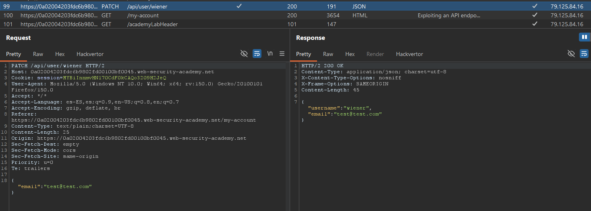
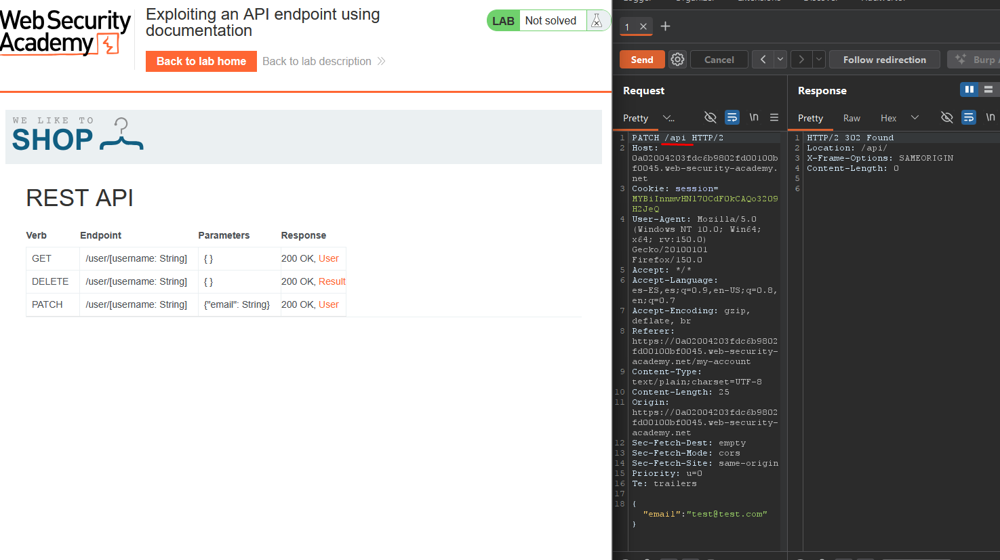

# Lab01: Exploiting an API endpoint using documentation
To solve the lab, find the exposed API documentation and delete `carlos`. You can log in to your own account using the following credentials: `wiener:peter`.

Difficulty: Easy

Link: https://portswigger.net/web-security/learning-paths/api-testing/api-testing-api-documentation/api-testing/lab-exploiting-api-endpoint-using-documentation

## Summary

- [Introduction](#introduction)
- [Exploitation](#exploitation)
- [Impact](#impact)

## Introduction
This lab explores an API that exposes documentation useful for discovering hidden or administrative endpoints when specific parts of the request path are removed. The goal is to discover this exposed API documentation, identify the administrative endpoint for user deletion, and delete the user carlos.

## Exploitation
First, I logged into my account using the provided credentials and accessed the email update functionality to capture the HTTP request. With Burp Suite open and the interceptor active, I submitted a simple email update to inspect how the application communicated with the API.

In the captured request, I observed that the application made a PATCH call to the user endpoint: `PATCH /api/user/wiener`

I then began removing parts of the path to observe how the API responded. When I removed wiener, the endpoint became `/api/user`, and the response returned a 400 error with the message `{"error":"Malformed URL: expecting an identifier"}`, which indicated that a user identifier was required. When I further removed user and left only `/api`, the response changed to 302 Found, indicating that I had reached a different area of the application, the exposed API documentation.

After opening this response in my browser, I accessed the API documentation panel, which listed all available endpoints. I identified the administrative route for user deletion and crafted a new request to delete the user carlos: `DELETE /api/user/carlos`

Upon sending this request, the API responded with: `{"status":"User deleted"}`
This confirmed that the user carlos was successfully deleted, completing the lab.

## Impact
The impact of this vulnerability is that exposed API documentation can reveal administrative functionality or sensitive routes that should not be discovered externally. When an attacker successfully identifies these endpoints, they can perform privileged actions—such as deleting users—thereby compromising the application's integrity and security