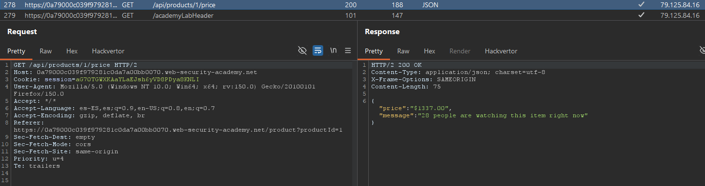
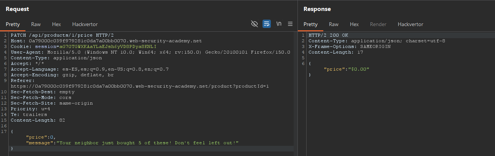

# Lab02: Finding and exploiting an unused API endpoint

To solve the lab, exploit a hidden API endpoint to buy a **Lightweight l33t Leather Jacket**. You can log in to your own account using the following credentials: `wiener:peter`.

Difficulty: Easy

Link: https://portswigger.net/web-security/learning-paths/api-testing/api-testing-identifying-and-interacting-with-api-endpoints/api-testing/lab-exploiting-unused-api-endpoint

## Summary

- [Introduction](#introduction)
- [Exploitation](#exploitation)
- [Impact](#impact)

## Introduction
This lab explores an unused API endpoint that remains accessible and allows modifying the price of a product. The goal is to discover this hidden endpoint, understand which methods and content types it accepts, and use it to change the price of the jacket and purchase it for 0.

## Exploitation
First, I logged into my account with the provided credentials and went to the jacket product. I added one item to the cart just to observe the HTTP request made by the application and identify which API endpoints were being used in the purchase flow.



When analyzing the request, I noticed that one of the calls was used to check the price of the jacket. This request had the format: `GET /api/products/1/price`

I sent this request to the Repeater to test variations of the HTTP method. First, I changed the method from GET to PATCH and sent it again. The API responded with the error `{"type":"ClientError","code":400,"error":"Only 'application/json' Content-Type is supported"}`, which indicated that the route existed but required JSON content.

From this, I added the correct header and tried to modify the price with a text-formatted value, but the response returned another error: `{"type":"ClientError","code":400,"error":"'price' parameter must be a valid non-negative integer"}`. This return made it clear that the endpoint accepted price updates, but the value had to be a non-negative integer.

Then I adjusted the request body to use a valid value, setting price to 0 and keeping `Content-Type: application/json`. With this, the API responded with status 200, confirming the price change was successful:

```
PATCH /api/products/1/price
Content-Type: application/json
{"price":0}
```



After this, the price of the jacket changed to 0.00, allowing me to purchase it and completing the lab.

## Impact
The impact of this flaw is that API endpoints that should be inactive or protected may remain exposed and accept sensitive operations, such as modifying business data. In the case of this lab, the lack of proper access control on the PATCH method allowed for altering an item's price, which, in a real-world system, would enable financial fraud and direct manipulation of the product database.
