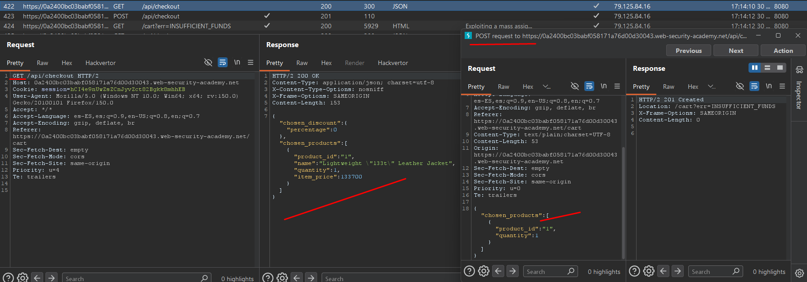
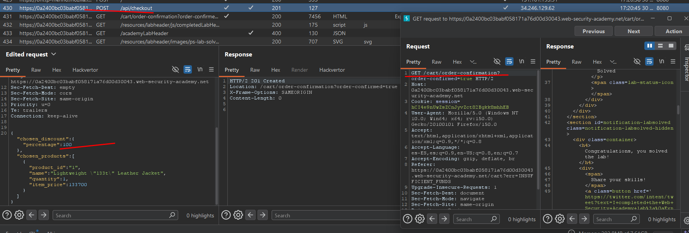

# Lab03: Exploiting a mass assignment vulnerability

To solve the lab, find and exploit a mass assignment vulnerability to buy a **Lightweight l33t Leather Jacket**. You can log in to your own account using the following credentials: `wiener:peter`.

Difficulty: Easy

Link: https://portswigger.net/web-security/learning-paths/api-testing/api-testing-mass-assignment-vulnerabilities/api-testing/lab-exploiting-mass-assignment-vulnerability

## Summary

- [Introduction](#introduction)
- [Exploitation](#exploitation)
- [Impact](#impact)

## Introduction
This lab demonstrates a "mass assignment" vulnerability in a checkout API. The goal is to exploit this flaw by adding hidden parameters to the payment request, specifically a 100% discount, allowing the purchase of the leather jacket for zero cost.

## Exploitation
First, I accessed the account with the credentials wiener:peter and added the leather jacket to the cart. During the purchase process, I analyzed the HTTP requests and noticed that the application sent two important calls: a GET detailing the cart contents (including the applied discount percentage, which was 0%) and a POST for checkout, which returned an error message indicating insufficient balance.



To exploit the vulnerability, I sent the `POST /api/checkout` request to the Repeater. Since the GET request already showed that a discount parameter was available but set to 0, I modified the payment request JSON to change the chosen_discount to 100%:

```
{
  "chosen_discount": {
    "percentage": 100
  },
  "chosen_products": [
    {
      "product_id": "1",
      "quantity": 1
    }
  ]
}
```

I sent the modified request with Burp Suite's interceptor active. The server successfully processed the chosen_discount parameter, applied the 100% discount, and confirmed the jacket purchase without needing to alter the product's original price via the API, thus completing the lab.



## Impact
The mass assignment vulnerability occurs when an application automatically processes user-supplied parameters that should not be modifiable. This allows attackers to inject hidden fields to escalate privileges, alter product prices, or manipulate sensitive data model fields, compromising the system integrity and business logic.