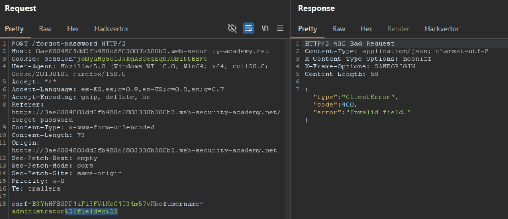
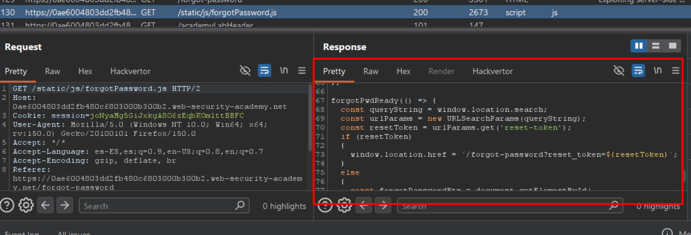
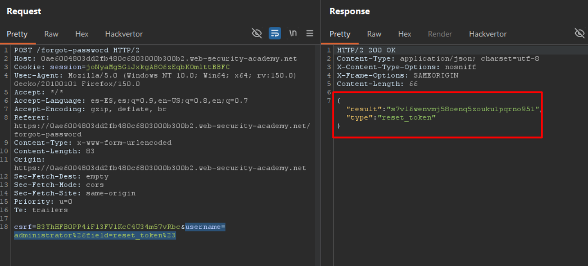

# Lab04: Exploiting server-side parameter pollution in a query string

To solve the lab, log in as the `administrator` and delete `carlos`.

Difficulty: Easy

Link: https://portswigger.net/web-security/learning-paths/api-testing/api-testing-testing-for-server-side-parameter-pollution-in-the-query-string/api-testing/server-side-parameter-pollution/lab-exploiting-server-side-parameter-pollution-in-query-string

## Summary

- [Introduction](#introduction)
- [Exploitation](#exploitation)
- [Impact](#impact)

## Introduction
This lab explores a server-side parameter pollution vulnerability in the password recovery functionality. The goal is to manipulate the query string that the application passes to an internal API to obtain a reset token for the administrator account and, with that, delete the carlos account.

## Exploitation
I went to My Account and tested the login. Without success, I clicked on "Forgot your password?". With teste it returned "Invalid user", but with administrator it said an email had been sent. I sent the POST /forgot-password to Burp Suite's Repeater.

The request had the parameters `csrf` and `username`. I tested `%26x=y` and got `{"error": "Parameter is not supported."}`. I tested `%23` and received `{"error": "Field not specified."}`. Combining both tests with `%26field=%23` resulted in `{"type":"ClientError","code":400,"error":"Invalid field."}`, confirming that field existed but was invalid.

To discover the correct value for field, I sent the request to the Intruder with a sniper attack on the parameter value. I tested a list of common words and, after a few minutes, found that email returned 200 OK, confirming it was a valid field.

Analyzing the JavaScript file loaded with the page `(/static/js/forgotPassword.js)`, I found an interesting endpoint: `/forgot-password?reset_token=${resetToken}`. This suggested that reset_token would be a useful field to exploit.

I returned to the Repeater and sent: `username=administrator%26field=reset_token%23`
The API processed the parameter pollution and returned a reset token for administrator. 

I accessed `/forgot-password?reset_token=s7vl6wenvmj58oenq5zouku1pqrno951` in the browser, reset the password, logged in as admin, and deleted carlos, completing the lab.

## Impact
Server-side parameter pollution allows an attacker to manipulate internal requests sent by the server to APIs or backend systems. This can lead to privilege escalation, security control bypass, execution of unauthorized administrative functions, and compromise of the application's business logic.