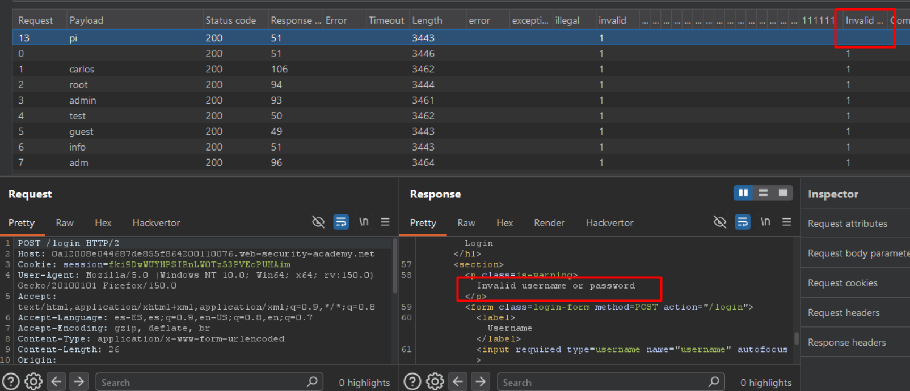
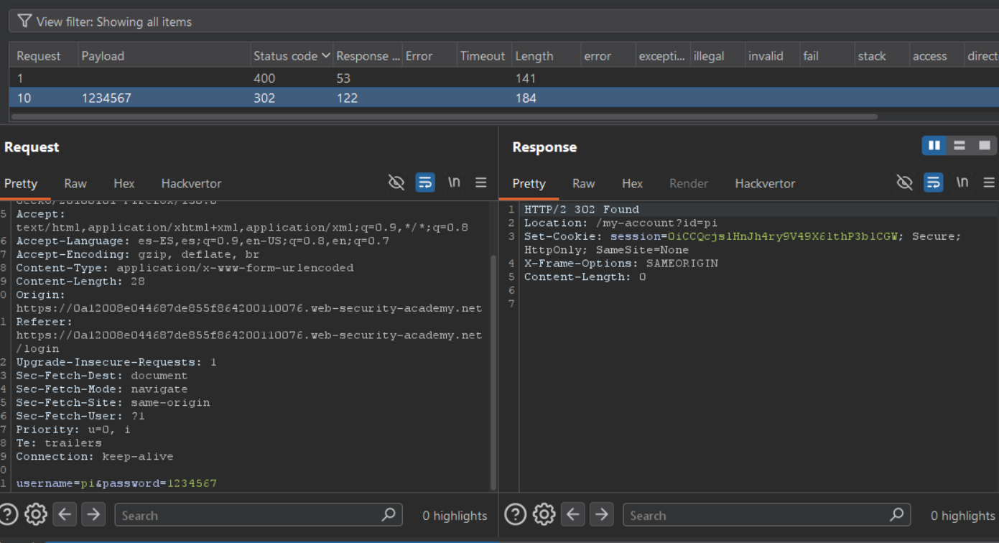

# Lab01: Username enumeration via subtly different responses

This lab is subtly vulnerable to username enumeration and password brute-force attacks. It has an account with a predictable username and password, which can be found in the following wordlists:

- [Candidate usernames](https://portswigger.net/web-security/authentication/auth-lab-usernames)
- [Candidate passwords](https://portswigger.net/web-security/authentication/auth-lab-passwords)

To solve the lab, enumerate a valid username, brute-force this user's password, then access their account page.

Difficulty: Easy

Link: https://portswigger.net/web-security/learning-paths/authentication-vulnerabilities/password-based-vulnerabilities/authentication/password-based/lab-username-enumeration-via-subtly-different-responses

## Summary

- [Introduction](#introduction)
- [Exploitation](#exploitation)
- [Impact](#impact)

## Introduction

This lab demonstrates a user enumeration vulnerability based on subtle differences in server responses during login attempts. Even when the application attempts to standardize error messages, small variations can reveal whether a username exists or not, which is highly relevant in authentication contexts as it enables more efficient brute-force attacks.

## Exploitation

Initially, a login attempt was performed using arbitrary credentials `(username=teste and password=teste)` to observe the application's behavior. The response displayed on the frontend was `"Invalid username or password."`, indicating that the application does not explicitly differentiate between a non-existent user and an incorrect password.

Based on this, the HTTP request was sent to Intruder in Burp Suite to automate a brute-force attack focused on username enumeration. A payload containing a list of potential usernames was configured, and a `Grep - Match` rule was added to detect the exact string `"Invalid username or password."`, as observed in the original response.

After running the attack, it was observed that for a specific user, pi, the server response was slightly different: the message did not include the trailing period `(.)`. This discrepancy indicates a different backend behavior, suggesting that the username exists and only the password is incorrect. This variation confirms the possibility of user enumeration based on response differences.

With a valid username identified, the next step was to perform a brute-force attack focused on the password field. Using Intruder again, now with the username fixed as pi, it was possible to quickly test multiple passwords.

Within seconds, an extremely weak password was successfully identified, allowing access to the pi user account and completing the lab.

## Impact

This vulnerability allows attackers to enumerate valid usernames based on subtle differences in application responses, significantly reducing the search space for brute-force attacks. Once a valid username is identified, attackers can focus password attempts more efficiently, increasing the likelihood of account compromise, especially when weak password policies are in place.