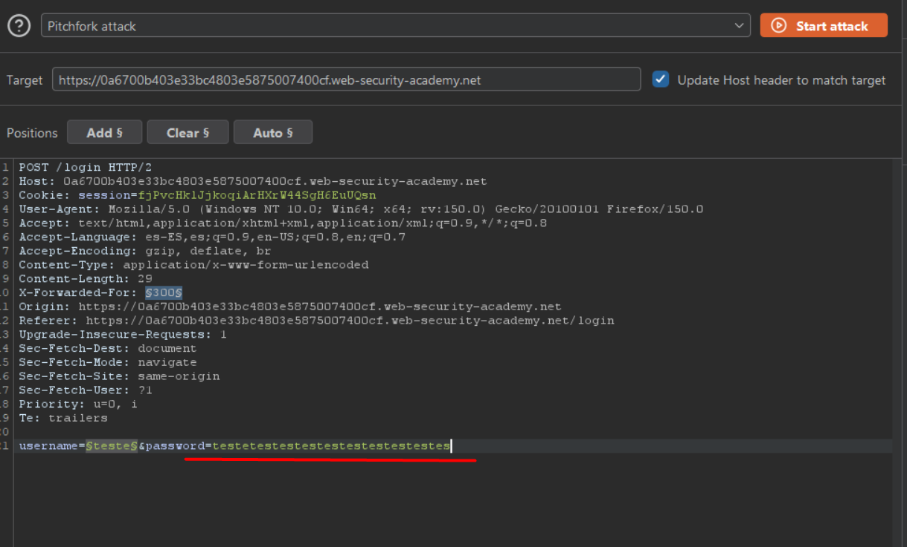
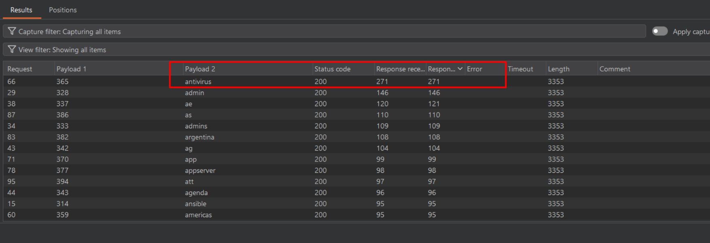

# Lab02: Username enumeration via response timing

This lab is vulnerable to username enumeration using its response times. To solve the lab, enumerate a valid username, brute-force this user's password, then access their account page.

- Your credentials: `wiener:peter`
- [Candidate usernames](https://portswigger.net/web-security/authentication/auth-lab-usernames)
- [Candidate passwords](https://portswigger.net/web-security/authentication/auth-lab-passwords)

To add to the challenge, the lab also implements a form of IP-based brute-force protection. However, this can be easily bypassed by manipulating HTTP request headers.

Difficulty: Easy

Link: https://portswigger.net/web-security/learning-paths/authentication-vulnerabilities/password-based-vulnerabilities/authentication/password-based/lab-username-enumeration-via-response-timing

## Summary

- [Introduction](#introduction)
- [Exploitation](#exploitation)
- [Impact](#impact)

## Introduction

This lab demonstrates a user enumeration vulnerability based on differences in the application's response time during login attempts. Even when error messages are standardized, variations in backend processing can introduce measurable delays, allowing attackers to identify valid usernames and optimize brute-force attacks.

## Exploitation

Initially, a login attempt was performed using arbitrary credentials `(username=teste and password=teste)` to observe the application's behavior. The frontend displayed the message `"Invalid username or password."`, indicating no direct distinction between an invalid username and an incorrect password.

The HTTP request was then sent to Intruder in Burp Suite, using a wordlist of possible usernames to identify any anomalies in the responses.

After several attempts, the application returned the message `'You have made too many incorrect login attempts. Please try again in 30 minute(s).'`, indicating the presence of a rate-limiting or account lockout mechanism. To bypass this restriction, the following header was added: `X-Forwarded-For`

The attack was executed again, but the IP was quickly blocked once more. To improve the approach, the attack mode was changed from Sniper to Pitchfork, allowing simultaneous brute-force across multiple parameters. The `X-Forwarded-For` header was configured to vary from 1 to 100, while the username list was tested in parallel.

Despite multiple attempts, all responses continued returning the same error message. At this point, a different strategy was applied: the password field was replaced with a significantly long string. The rationale was that if the username were invalid, the application would likely reject the request quickly. However, if the username were valid, processing a long incorrect password would take more time, resulting in a noticeable delay in the response.

Using this approach, a distinct timing difference was observed for a specific username, confirming it as a valid account based on response time.

-

Once the valid username was identified, a brute-force attack was conducted against the password field. Within a few minutes, the correct password was found, allowing access to the antivirus account and completing the lab.

## Impact

This vulnerability enables attackers to enumerate valid usernames based on response time discrepancies, even when error messages are uniform. As a result, attackers can focus password brute-force efforts on confirmed accounts, significantly increasing the likelihood of successful account compromise.