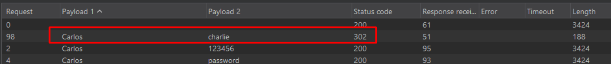

# Lab03: Broken brute-force protection, IP block

This lab is vulnerable due to a logic flaw in its password brute-force protection. To solve the lab, brute-force the victim's password, then log in and access their account page.

- Your credentials: `wiener:peter`
- Victim's username: `carlos`
- [Candidate passwords](https://portswigger.net/web-security/authentication/auth-lab-passwords)

Link: https://portswigger.net/web-security/learning-paths/authentication-vulnerabilities/password-based-vulnerabilities/authentication/password-based/lab-broken-bruteforce-protection-ip-block

## Summary

- [Introduction](#introduction)
- [Exploitation](#exploitation)
- [Impact](#impact)

## Introduction

This lab aims to exploit a flawed brute-force protection mechanism based on IP blocking. The application attempts to mitigate multiple failed login attempts, but implements a vulnerable logic that can be bypassed by manipulating how attempts are counted. This type of issue is relevant because it allows credential brute forcing even when defensive controls appear to be in place.

## Exploitation

Initially, a login attempt was made using arbitrary credentials to capture and analyze the HTTP request. This request was then sent to Burp Suite's Intruder, where the password parameter was identified as the injection point for a brute-force attack.

When starting the attack, it was observed that after a few consecutive attempts, the IP address was blocked. Further analysis showed that the block occurred after three consecutive failed login attempts for the same user. However, it was also noticed that a successful login attempt would reset this counter.

Based on this behavior, the hypothesis was that the block could be bypassed by interleaving valid and invalid login attempts. To implement this, the attack configuration in Intruder was adjusted: the Resource Pool settings were modified to limit concurrency to a single request at a time, preventing multiple simultaneous attempts that could trigger the block more quickly.

Next, two payload lists were prepared. The first alternated between the users `wiener` and `carlos`. The second contained a list of possible passwords, interleaved with the valid password for `wiener:peter`. The goal was to ensure that after each failed login attempt against `carlos`, a successful login with `wiener` would follow, resetting the failed attempt counter.

With this setup, the attack was able to proceed without triggering the IP block. After some time, the correct password for the user `carlos` was identified, allowing access to the account and successfully completing the lab.

## Impact

This vulnerability allows attackers to bypass brute-force protection mechanisms by exploiting flaws in the attempt-counting logic. As demonstrated, an attacker can automate login attempts without being effectively blocked, enabling credential discovery and account compromise.