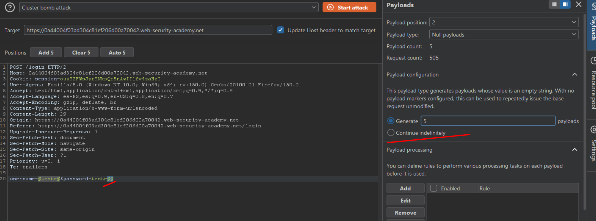
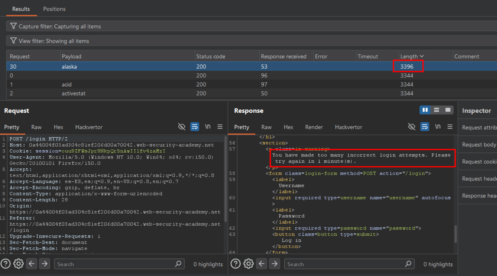
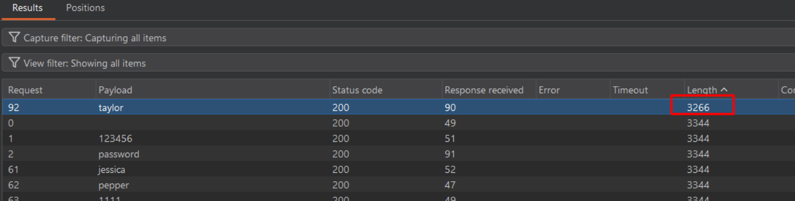

# Lab04: Username enumeration via account lock

This lab is vulnerable to username enumeration. It uses account locking, but this contains a logic flaw. To solve the lab, enumerate a valid username, brute-force this user's password, then access their account page.

- [Candidate usernames](https://portswigger.net/web-security/authentication/auth-lab-usernames)
- [Candidate passwords](https://portswigger.net/web-security/authentication/auth-lab-passwords)

Link: https://portswigger.net/web-security/learning-paths/authentication-vulnerabilities/password-based-vulnerabilities/authentication/password-based/lab-username-enumeration-via-account-lock

## Summary

- [Introduction](#introduction)
- [Exploitation](#exploitation)
- [Impact](#impact)

## Introduction

This lab demonstrates a username enumeration vulnerability based on account lock mechanisms triggered by multiple failed login attempts. The application exhibits different behavior when a valid user is subjected to repeated login attempts, making it possible to distinguish existing accounts from non-existent ones. This type of vulnerability is relevant because it enables more efficient and targeted brute force attacks.

## Exploitation

Initially, a simple login attempt was performed using generic credentials `(teste:teste)` in order to capture the HTTP request and analyze it. This request was then sent to Intruder.

In Intruder, the `Cluster Bomb attack` type was used to test multiple usernames combined with repeated attempts for each one. To simulate consecutive login attempts and trigger the lock mechanism, a `Null payload` (5x) was added, allowing the same request to be sent multiple times per username.

This behavior is important because applications with brute force protections often apply lockouts only to valid users. By forcing multiple attempts for each username, it becomes possible to observe differences in how the server responds.

After some time running the attack, one of the responses showed a different response length compared to the others. This variation indicated that the server handled that specific username differently, returning a “too many attempts” message, which strongly suggests that the username is valid.

With a valid username identified, a new brute force attack was performed focusing only on the password field. During this phase, it was again observed that certain responses had a different length, indicating a different server behavior when processing the correct password.

Based on this observation, a manual login attempt was made using the identified credentials `(alaska:taylor)`. The authentication was successful, confirming the exploitation and completing the lab.

## Impact

This vulnerability allows attackers to enumerate valid usernames by observing differences in application behavior during repeated login attempts, significantly reducing the search space for brute force attacks. Once valid usernames are identified, attackers can focus on password discovery, increasing the likelihood of account compromise.