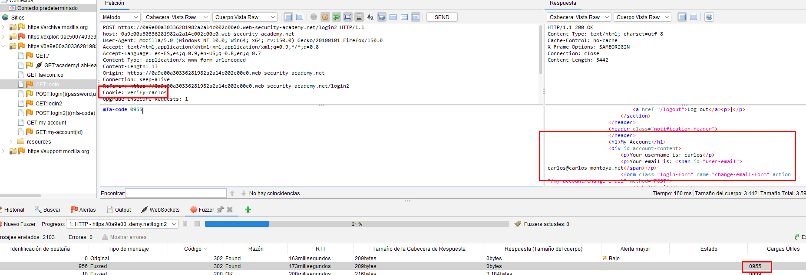

# Lab05: 2FA broken logic

This lab's two-factor authentication is vulnerable due to its flawed logic. To solve the lab, access Carlos's account page.

- Your credentials: `wiener:peter`
- Victim's username: `carlos`

You also have access to the email server to receive your 2FA verification code.

Link: https://portswigger.net/web-security/learning-paths/authentication-vulnerabilities/vulnerabilities-in-multi-factor-authentication/authentication/multi-factor/lab-2fa-broken-logic

## Summary

- [Introduction](#introduction)
- [Exploitation](#exploitation)
- [Impact](#impact)

## Introduction

This lab demonstrates a logic flaw in a 2FA authentication flow, where the second-factor verification is not properly tied to the user’s session. The vulnerability allows manipulation of the verification process to attempt authentication as another user without access to their second factor, highlighting a common issue in poorly implemented session handling and identity validation.

## Exploitation

Initially, login was performed using the credentials provided by the lab, completing the normal 2FA flow while intercepting HTTP requests in Burp Suite. This made it possible to observe how the authentication process worked and understand the sequence of requests involved. During this step, it was identified that after submitting valid credentials, but before completing the 2FA step, the application already issued a session cookie.

With this behavior in mind, the session was terminated and a new login attempt was made with the interceptor enabled. The initial login request `POST` was allowed to pass normally. However, when the second request `(login2 via GET)` was intercepted, responsible for triggering the delivery of the 2FA code, the session cookie was removed and the user parameter was modified to carlos. This indicates that the 2FA step was not properly bound to the original authenticated session.

Next, the `login2 POST` request, responsible for validating the verification code, was located in the Burp history and prepared for brute force. Since there was no access to Carlos’s email, the goal was to guess the 2FA code, which consisted of only 4 digits, totaling `10000` possible combinations.

Due to limitations in Burp Suite Community Edition for automated attacks, the `OWASP ZAP` fuzzer was used to perform the brute force against the mfa-code parameter. Within a short time, a valid response was identified, revealing the correct code.

This allowed completion of the authentication flow as the user carlos, successfully gaining access to the account without needing legitimate access to the second factor.

## Impact

This vulnerability allows an attacker to bypass the 2FA mechanism by exploiting improper linkage between the authentication session and the second-factor verification step. As demonstrated, it is possible to manipulate requests and brute force the verification code to take over another user’s account, leading to full authentication bypass and unauthorized access to sensitive data.