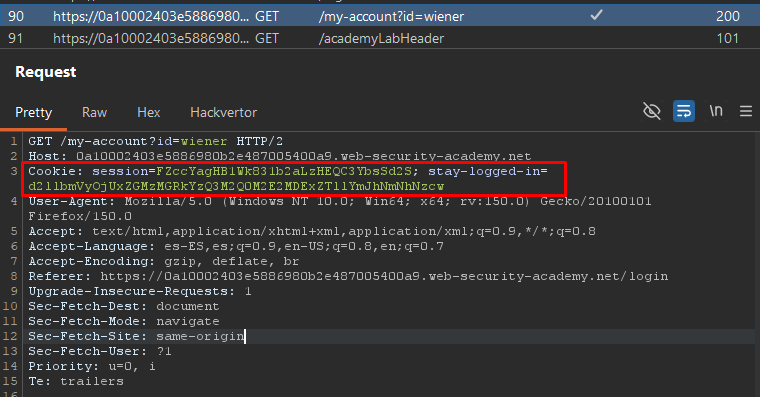
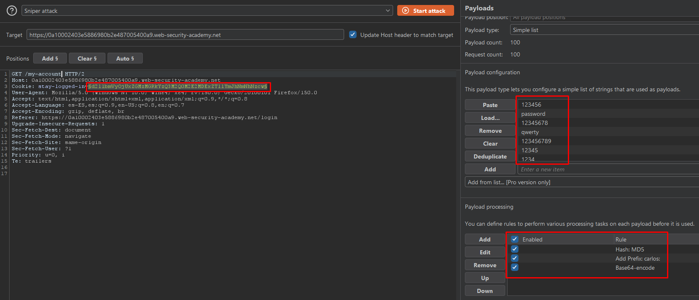
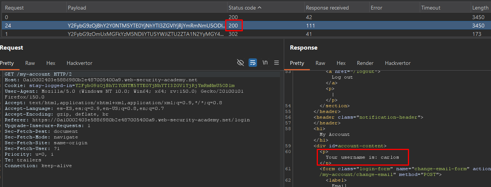

# Lab06: Brute-forcing a stay-logged-in cookie

This lab allows users to stay logged in even after they close their browser session. The cookie used to provide this functionality is vulnerable to brute-forcing.

To solve the lab, brute-force Carlos's cookie to gain access to his **My account** page.

- Your credentials: `wiener:peter`
- Victim's username: `carlos`
- [Candidate passwords](https://portswigger.net/web-security/authentication/auth-lab-passwords)

Difficulty: Easy

Link: https://portswigger.net/web-security/learning-paths/authentication-vulnerabilities/vulnerabilities-in-other-authentication-mechanisms/authentication/other-mechanisms/lab-brute-forcing-a-stay-logged-in-cookie

## Summary

- [Introduction](#introduction)
- [Exploitation](#exploitation)
- [Impact](#impact)

## Introduction
This lab demonstrates a vulnerability in the “stay logged in” functionality, where the mechanism responsible for maintaining authenticated sessions uses predictable cookies based on sensitive user information. The objective of the exercise is to identify how the cookie is generated, understand its structure, and exploit the weakness in the persistent authentication process to compromise another account through brute force.

## Exploitation

First, I logged in using the credentials provided by the lab and checked the “Stay logged in” option. Right after authentication, it was possible to observe that the `GET` request for the account page included a cookie named stay-logged-in.

The cookie value was sent to Burp Suite Decoder and decoded from Base64. The result was the following:

`d2llbmVyOjUxZGMzMGRkYzQ3M2Q0M2E2MDExZTllYmJhNmNhNzcw`

After decoding:

`wiener:51dc30ddc473d43a6011e9ebba6ca770`

This indicated that the cookie stored the username followed by a hash associated with the persistent authentication mechanism. After removing the username portion, I attempted to identify the hash format directly but without success. I then used an external website to analyze the value and confirmed that it was an `MD5 hash`.

When decoding the hash, it revealed my own password:

`51dc30ddc473d43a6011e9ebba6ca770:peter`

At this point, it became clear that the cookie structure followed this format:

`base64(user:md5(password))`

With this information, I sent the previous `GET` request for the account page to Burp Suite Intruder. I removed the session cookie since it was regenerated on every new session, and I also removed the id=wiener value from the endpoint to avoid direct dependency on the authenticated user.

The attack was configured using the stay-logged-in parameter as the main payload target. A password wordlist was used and, in the Payload Processing section, Burp Suite was configured to automatically generate values matching the expected cookie format.

After a few seconds, one of the responses returned successfully authenticated, allowing access to the carlos account through brute forcing the persistent authentication cookie.

## Impact

This vulnerability allows attackers to compromise other user accounts by predicting and manipulating the persistent authentication mechanism. Since the cookie only relies on the username combined with an MD5 hash of the password, an attacker can perform offline or automated brute force attacks to generate valid authentication cookies without needing the victim’s legitimate session, resulting in unauthorized account access.