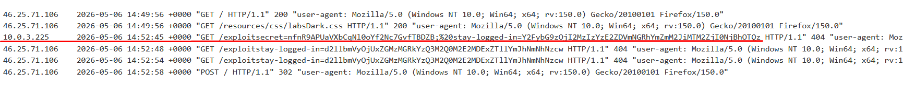
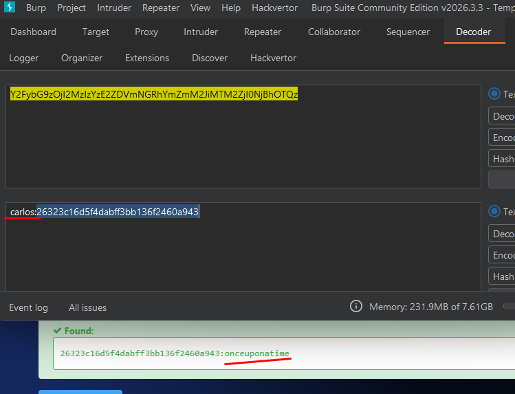

# Lab07: Offline password cracking

This lab stores the user's password hash in a cookie. The lab also contains an XSS vulnerability in the comment functionality. To solve the lab, obtain Carlos's `stay-logged-in` cookie and use it to crack his password. Then, log in as `carlos` and delete his account from the "My account" page.

- Your credentials: `wiener:peter`
- Victim's username: `carlos`

Difficulty: Easy

Link: https://portswigger.net/web-security/learning-paths/authentication-vulnerabilities/vulnerabilities-in-other-authentication-mechanisms/authentication/other-mechanisms/lab-offline-password-cracking

## Summary

- [Introduction](#introduction)
- [Exploitation](#exploitation)
- [Impact](#impact)

## Introduction

This lab demonstrates a combination of vulnerabilities involving insecure persistent authentication and Cross-Site Scripting (XSS). The objective of the exercise is to identify how the “stay logged in” mechanism stores sensitive information inside the cookie and exploit a stored XSS vulnerability to capture another user’s cookie, allowing credential recovery through offline password cracking.

## Exploitation

First, I logged in using the credentials provided by the lab and checked the “Stay logged in” option. Right after authentication, it was possible to observe that the `GET` request for the account page included a cookie named stay-logged-in.

The cookie value was sent to Burp Suite Decoder and decoded from Base64. The result was the following:

`d2llbmVyOjUxZGMzMGRkYzQ3M2Q0M2E2MDExZTllYmJhNmNhNzcw`

After decoding:

`wiener:51dc30ddc473d43a6011e9ebba6ca770`

This indicated that the cookie stored the username followed by a hash associated with the persistent authentication mechanism. After removing the username portion, I attempted to identify the hash format directly but without success. I then used an external website to analyze the value and confirmed that it was an `MD5 hash`.

When decoding the hash, it revealed my own password:

`51dc30ddc473d43a6011e9ebba6ca770:peter`

At this point, it became clear that the cookie structure followed this format:

`base64(user:md5(password))`

Since the application worked as a blog, I continued exploring the posts and noticed that there was a comment section available. This suggested a possible attack surface for stored XSS.
The first test was simple, only to verify whether the input accepted unsanitized HTML:

`<h1>HI</h1>`

The payload worked correctly, confirming the XSS vulnerability. From there, the next step was to use the field to capture another user’s cookie.
I already had a server prepared to receive incoming requests, so I submitted the following payload inside a comment:

``

The script redirected the victim to my server while appending the value of document.cookie. Shortly after, I observed a different IP address accessing the blog, indicating that another user had loaded the malicious comment.

With the captured cookie, I once again sent the value to Burp Suite Decoder and then to the external website previously used to identify the MD5 hash. After the decoding process, I obtained the target user’s credentials:

`carlos:onceuponatime`

Finally, I authenticated into the carlos account using the recovered credentials and confirmed the account deletion to complete the lab.

## Impact

This vulnerability allows an attacker to capture persistent authentication cookies from other users through stored XSS and recover their credentials via offline password cracking. Since the “stay logged in” mechanism relies on predictable MD5 hashes directly derived from the user’s password, any exposed cookie can result in full account compromise without requiring further victim interaction beyond viewing the malicious content.