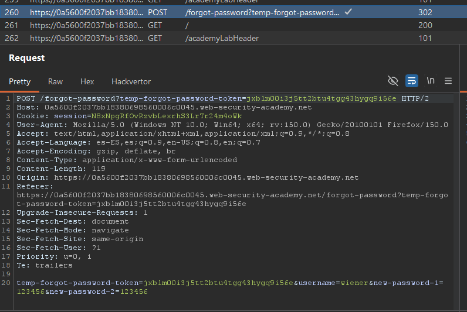
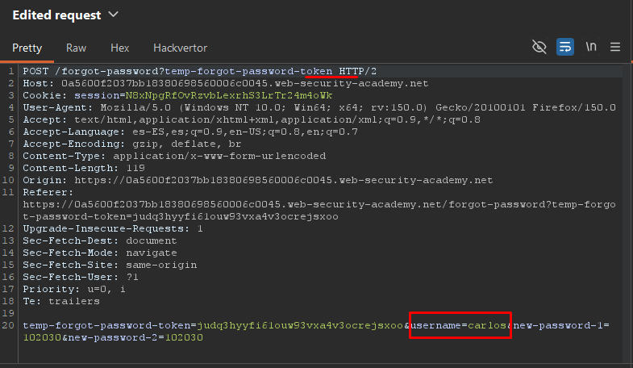

# Lab08: Password reset broken logic

This lab's password reset functionality is vulnerable. To solve the lab, reset Carlos's password then log in and access his "My account" page.

- Your credentials: `wiener:peter`
- Victim's username: `carlos`

Difficulty: Easy

Link: https://portswigger.net/web-security/learning-paths/authentication-vulnerabilities/vulnerabilities-in-other-authentication-mechanisms/authentication/other-mechanisms/lab-password-reset-broken-logic

## Summary

- [Introduction](#introduction)
- [Exploitation](#exploitation)
- [Impact](#impact)

## Introduction

The objective of this lab is to exploit a flaw in the application's password reset logic. During the account recovery flow, the backend fails to properly validate the token used in the reset process, allowing an attacker to change another user's password without authorization. This type of vulnerability is critical because it directly compromises account integrity.

## Exploitation

The first step was to initiate the `“Forgot Password”` flow in order to analyze all requests involved in the password reset process. Among them, the request that stood out the most was the one responsible for actually updating the user’s password.



The request contained both the username parameter and the new password, in addition to the token present in the endpoint. This suggested that the backend might not be properly validating the token before processing the password change.
To test this behavior, the POST request was sent to Burp Suite Repeater and the token present in the URL was manually removed before sending the request again. Even without the token, the server responded with a `302`, indicating that the operation had been accepted by the backend.

After confirming this behavior, the process was repeated once more. A new password reset request was submitted, and an email containing the reset link was received. After opening the link and submitting the new password confirmation, the request was intercepted before being automatically sent to the server.
With the request paused in the interceptor, the token present in the endpoint was removed and the username parameter was changed from wiener to carlos. As a result, the request originally generated to change the current user’s password was repurposed to reset the target account’s password.

```
POST /forgot-password?temp-forgot-password-token=
username=carlos&new-password-1=password&new-password-2=password
```

After forwarding the modified request, the application successfully changed the password for the user carlos, demonstrating that the backend accepted the password reset operation without validating the recovery token.



Finally, it was only necessary to log into Carlos’s account using the newly defined password to solve the lab.

## Impact

This vulnerability allows an attacker to reset other users’ passwords without possessing a valid recovery token, leading to full account compromise. Since the backend trusts user-controlled parameters without properly validating authorization, any account in the application can potentially be taken over.