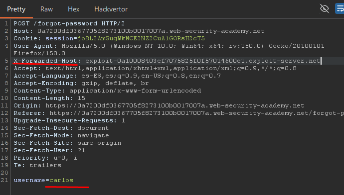
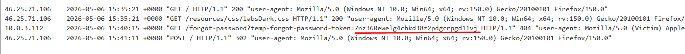

# Lab09: Password reset poisoning via middleware

This lab is vulnerable to password reset poisoning. The user `carlos` will carelessly click on any links in emails that he receives. To solve the lab, log in to Carlos's account. You can log in to your own account using the following credentials: `wiener:peter`. Any emails sent to this account can be read via the email client on the exploit server.

Link: https://portswigger.net/web-security/learning-paths/authentication-vulnerabilities/vulnerabilities-in-other-authentication-mechanisms/authentication/other-mechanisms/lab-password-reset-poisoning-via-middleware 

## Summary

- [Introduction](#introduction)
- [Exploitation](#exploitation)
- [Impact](#impact)

## Introduction

This lab demonstrates a password reset poisoning vulnerability caused by the insecure use of user-controlled headers during password reset link generation. The objective is to exploit how the application's middleware uses the `X-Forwarded-Host` header when building reset URLs, allowing the token to be sent to an attacker-controlled domain.

## Exploitation

First, a test was performed on the `“Forgot password”` functionality. Unlike the previous lab, the reset token is dynamically generated by a middleware component, which slightly changes the exploitation process.

The password reset request was sent to Burp Suite Repeater to analyze how the application generated the password reset link. In this scenario, testing the `X-Forwarded-Host` header becomes relevant because applications behind reverse proxies or load balancers often trust this header to determine the original host of the request. When this value is not properly validated, it becomes possible to influence the URL generated by the backend.

The `X-Forwarded-Host` header was then added pointing to a personal server configured to receive incoming requests. Additionally, the username parameter was changed to carlos, allowing the generation of a manipulated password reset request for the victim account.

After sending the request, the password reset token was received on the server being used to capture incoming requests, confirming that the application was using the `X-Forwarded-Host` value while constructing the password reset link sent by email.

With the token obtained, the next step was to access the wiener email account, copy the legitimate password reset link, and replace only the final token value with the one captured previously. Accessing the modified URL allowed the password for user carlos to be successfully reset, completing the lab.

## Impact

This vulnerability allows an attacker to intercept or capture password reset tokens by manipulating headers used by the application when generating absolute URLs. As a result, it becomes possible to fully compromise other user accounts without having access to the victim’s email account, directly impacting the confidentiality and integrity of the affected account.