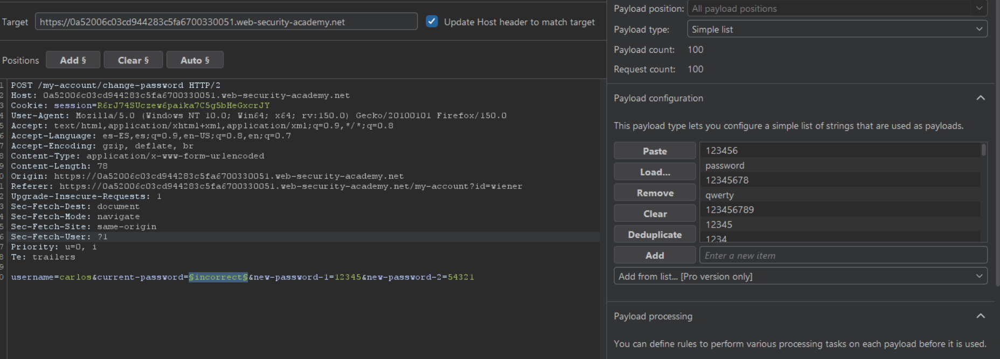
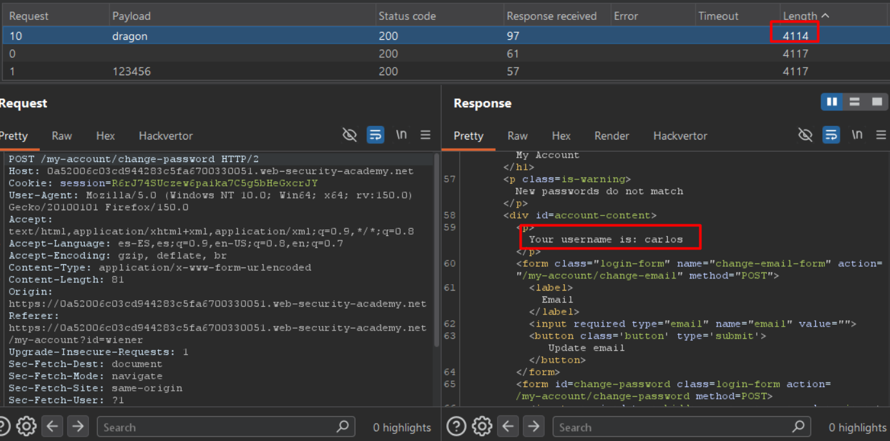

# Lab10: Password brute-force via password change

This lab's password change functionality makes it vulnerable to brute-force attacks. To solve the lab, use the list of candidate passwords to brute-force Carlos's account and access his "My account" page.

- Your credentials: `wiener:peter`
- Victim's username: `carlos`
- [Candidate passwords](https://portswigger.net/web-security/authentication/auth-lab-passwords)

Difficulty: Easy

Link: https://portswigger.net/web-security/learning-paths/authentication-vulnerabilities/vulnerabilities-in-other-authentication-mechanisms/authentication/other-mechanisms/lab-password-brute-force-via-password-change

## Summary

- [Introduction](#introduction)
- [Exploitation](#exploitation)
- [Impact](#impact)

## Introduction

This lab demonstrates a brute-force vulnerability in a password change functionality. The goal is to exploit differences in the application's responses during the password change process to identify valid credentials without triggering account lockout mechanisms. This type of vulnerability is relevant because it allows credential discovery through secondary application features.

## Exploitation

First, I logged into my own lab account and accessed the password change functionality to analyze how the application processed the HTTP request. After performing a test password change, I observed that the application sent the following parameters:

`username=wiener&current-password=peter&new-password-1=1234&new-password-2=1234`

From there, I started testing different scenarios to understand the application's validation behavior. When an incorrect current password was submitted, the application redirected back to the login page and displayed the message: `Current password is incorrect`

However, when the current password was correct but the new password fields did not match, the response returned: `New passwords do not match`

Even after multiple failed attempts, I noticed that the account was not locked and no rate limiting was applied. This raised the hypothesis that the error messages could be used as an oracle for brute forcing the current password.

I then performed another test by intentionally sending an incorrect current password while keeping the two new password fields different. In this scenario, the application still responded only with: `Current password is incorrect`

and continued allowing unlimited attempts without locking the account. This behavior confirmed that it was possible to automate password guessing attempts without triggering protection mechanisms.

With that confirmed, I sent the request to Burp Suite Intruder and prepared a brute-force attack. I changed the username parameter to carlos, used a wordlist payload on the current-password parameter, and intentionally kept new-password-1 and new-password-2 different so the response would change once the correct password was identified.

After a few seconds, I was able to identify the correct password for the carlos user through the application's response differences. I then logged into the account and completed the lab.

## Impact

This vulnerability allows brute-force attacks through the password change functionality, enabling attackers to discover valid credentials without account lockout or request throttling. Since the application clearly differentiates validation errors during the password change process, an attacker can automate requests and determine when the current password is correct, leading to unauthorized access to other user accounts.