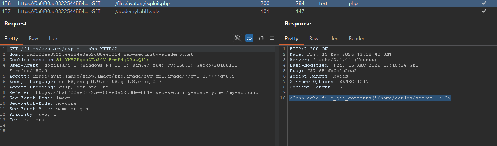

# Lab01: Web shell upload via path traversal

This lab contains a vulnerable image upload function. The server is configured to prevent execution of user-supplied files, but this restriction can be bypassed by exploiting a secondary vulnerability.
To solve the lab, upload a basic PHP web shell and use it to exfiltrate the contents of the file `/home/carlos/secret`. Submit this secret using the button provided in the lab banner.
You can log in to your own account using the following credentials: `wiener:peter`

Difficulty: https://portswigger.net/web-security/learning-paths/file-upload-vulnerabilities/preventing-file-execution-in-user-accessible-directories/file-upload/lab-file-upload-web-shell-upload-via-path-traversal

Link: Easy

## Summary

- [Introduction](#introduction)
- [Exploitation](#exploitation)
- [Impact](#impact)

## Introduction

This lab demonstrates a path traversal vulnerability during file upload functionality. The goal is to exploit an avatar upload feature to store a PHP file inside an executable directory on the server, allowing arbitrary code execution and access to sensitive application data.

## Exploitation

The first step was accessing the account using the credentials provided by the lab. After logging in, it was possible to identify an avatar upload functionality available in the user profile.

To test the upload behavior, a file called `exploit.php` was created containing a simple script to read the contents of `/home/carlos/secret`:

```php id="byeyzx"
<?php echo file_get_contents('/home/carlos/secret'); ?>
```

When uploading the file normally, the application accepted the upload successfully. However, when accessing the uploaded file, the PHP content was rendered only as plain text, indicating that the file had been stored inside a non-executable directory.



The HTTP POST request responsible for the upload was then sent to Burp Repeater for manual manipulation. During the analysis, it was observed that the filename was defined inside the `Content-Disposition` header, suggesting the possibility of a path traversal vulnerability in the server-side file handling process.

The first test consisted of adding `../` to the filename in an attempt to move back one directory and change the upload destination. Even after the modification, the application returned the same response: `The file avatars/exploit.php has been uploaded.`

Despite that, when repeating the GET request to access the uploaded file, the content was still treated as plain text.

Based on this behavior, different path traversal variations were tested in an attempt to bypass possible server-side filtering mechanisms. Using the following payload in the filename: `..%2fexploit.php`

the application once again responded indicating that the upload was successful. However, attempting to access the file through the previous path resulted in a 404 response, suggesting that the file was no longer being stored inside the default avatars directory.

After manually modifying the request to: `GET /files/exploit.php`

it became possible to access the uploaded PHP file directly and retrieve the contents of `/home/carlos/secret`, successfully obtaining Carlos's credentials and completing the lab.


## Impact

This vulnerability allows an attacker to abuse path traversal during file upload operations to store malicious files inside executable server directories. In practice, this can lead to remote code execution, unauthorized access to sensitive application files, and full compromise of the affected server.
