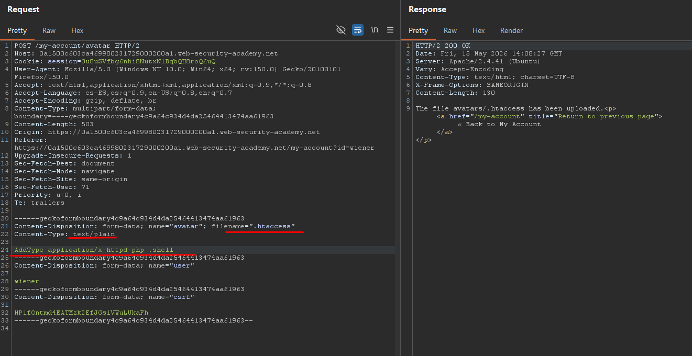
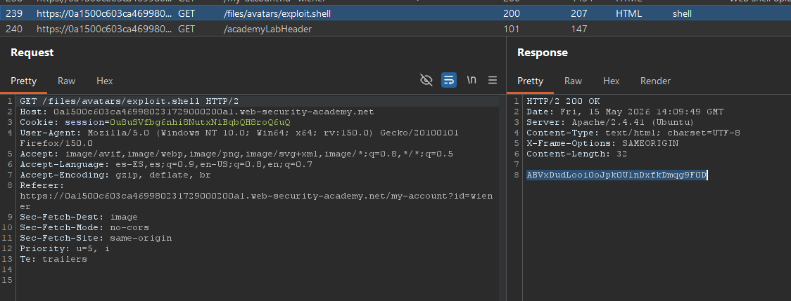

# Lab02: Web shell upload via extension blacklist bypass

This lab contains a vulnerable image upload function. Certain file extensions are blacklisted, but this defense can be bypassed due to a fundamental flaw in the configuration of this blacklist.

To solve the lab, upload a basic PHP web shell, then use it to exfiltrate the contents of the file `/home/carlos/secret`. Submit this secret using the button provided in the lab banner.

You can log in to your own account using the following credentials: `wiener:peter`

Difficulty: Easy

Link: https://portswigger.net/web-security/learning-paths/file-upload-vulnerabilities/insufficient-blacklisting-of-dangerous-file-types/file-upload/lab-file-upload-web-shell-upload-via-extension-blacklist-bypass

## Summary

- [Introduction](#introduction)
- [Exploitation](#exploitation)
- [Impact](#impact)

## Introduction

This lab demonstrates an upload validation flaw based only on an extension blacklist. The goal is to exploit the avatar upload functionality to upload and execute a web shell on the server. This type of vulnerability is relevant because insecure upload configurations can lead to remote code execution through crafted files and specific web server configurations.

## Exploitation

After logging in with the credentials provided by the lab, it was possible to identify an image upload functionality used to change the user avatar. The first attempt consisted of uploading a simple PHP web shell that had already been prepared from previous labs:

```php id="epce2z"
<?php echo file_get_contents('/home/carlos/secret'); ?>
```

The upload was blocked by the application, which returned an error message stating that `.php` files were not allowed. This indicated that the validation mechanism was based on an extension blacklist.

While analyzing the HTTP response from the upload request, the following header was identified: `Server: Apache/2.4.41 (Ubuntu)`

Knowing that the server was running Apache, the hypothesis was that it might be possible to abuse an `.htaccess` file to define a new extension that would be interpreted as PHP.

The POST request was then manually modified. The `filename` was changed to `.htaccess`, the `Content-Type` was changed to `text/plain`, and the file content became: `AddType application/x-httpd-php .shell`

After sending the request, the server responded successfully: `The file avatars/.htaccess has been uploaded`



With the new configuration applied to the upload directory, the original request was reused. This time, only the filename was changed to: `exploit.shell`

The content remained the PHP web shell. The upload was accepted successfully.

After reloading the page, it was possible to observe that the `exploit.shell` file had been processed by the Apache server as PHP code. A GET request to the file successfully returned the contents of: `/home/carlos/secret` thus obtaining the password of the `carlos` user and completing the lab.



## Impact

This vulnerability allows bypassing the upload restrictions enforced by the application, making it possible to upload and execute arbitrary files on the server. In this scenario, the use of a `.htaccess` file allowed redefining which extensions would be interpreted as PHP by Apache, resulting in remote code execution and access to sensitive system files.
