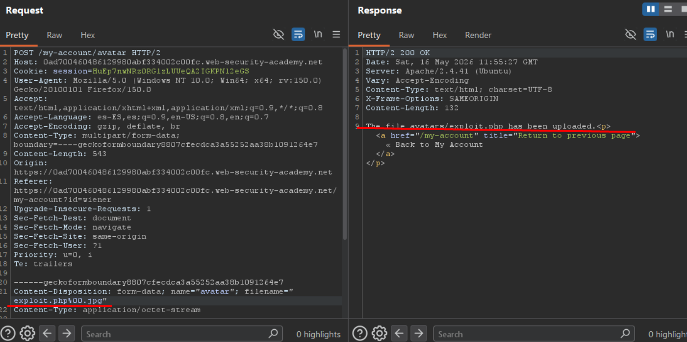
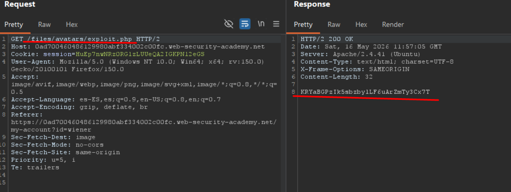

# Lab03: Web shell upload via obfuscated file extension

This lab contains a vulnerable image upload function. Certain file extensions are blacklisted, but this defense can be bypassed using a classic obfuscation technique.

To solve the lab, upload a basic PHP web shell, then use it to exfiltrate the contents of the file `/home/carlos/secret`. Submit this secret using the button provided in the lab banner.

You can log in to your own account using the following credentials: `wiener:peter`

Difficulty: Easy

Link: https://portswigger.net/web-security/learning-paths/file-upload-vulnerabilities/insufficient-blacklisting-of-dangerous-file-types/file-upload/lab-file-upload-web-shell-upload-via-obfuscated-file-extension

## Summary

- [Introduction](#introduction)
- [Exploitation](#exploitation)
- [Impact](#impact)

## Introduction

This lab demonstrates an insecure file upload vulnerability caused by improper extension validation. The objective is to exploit the avatar upload functionality to upload a malicious PHP file and achieve code execution on the server. This type of issue is relevant because applications that incorrectly validate file extensions may allow web shell uploads and lead to full server compromise.

## Exploitation

First, the login was performed using the credentials provided by the lab. After accessing the application, an image upload field for changing the user avatar was identified.

The first test consisted of uploading a PHP script saved in a file named `exploit.php`:

```php id="byeyzx"
<?php echo file_get_contents('/home/carlos/secret'); ?>
```

When attempting to upload the `.php` file, the application returned an error stating that PHP files were not allowed and that only `.jpg` files could be uploaded. This behavior indicated that the upload functionality was performing extension validation.

From there, the upload POST request was sent to Burp Suite Repeater in order to manually manipulate the filename. The first test performed was changing the filename to: `exploit.php.jpg`

The server accepted the file upload, but the content was treated only as static text and the PHP code was not executed. This indicated that the backend was likely relying on the last extension in the filename to determine how the file should be processed.

Based on this behavior, another test was performed using a null byte in an attempt to terminate the string interpretation on the server side: `exploit.php%00.jpg`



This time, the upload was accepted successfully. After reloading the page, it was observed that the GET request for the uploaded file returned a 404 error, which raised the suspicion that the backend may have stored the file differently from the displayed filename.

The GET request was then sent to Repeater and the file path was manually changed from: `GET /files/avatars/exploit%00.php` to: `GET /files/avatars/exploit.php`

After modifying the path, the server executed the PHP script successfully and returned the contents of `/home/carlos/secret`, exposing the credentials of the user carlos and completing the lab successfully.



## Impact

This vulnerability allows attackers to bypass file upload validation through the use of obfuscated extensions and null byte injection. As a result, an attacker can upload and execute arbitrary PHP files on the server, leading to remote code execution and potential full compromise of the affected application and underlying system.
