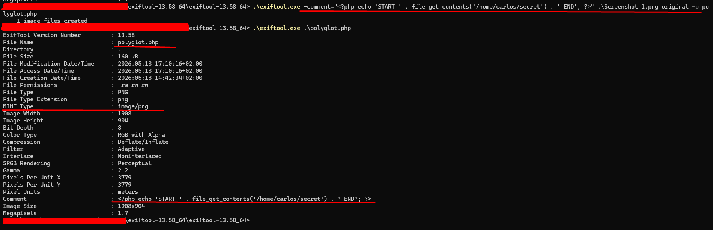
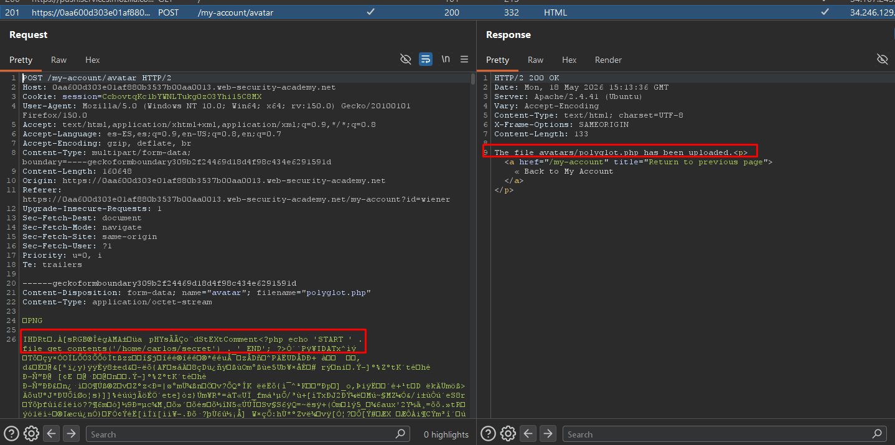
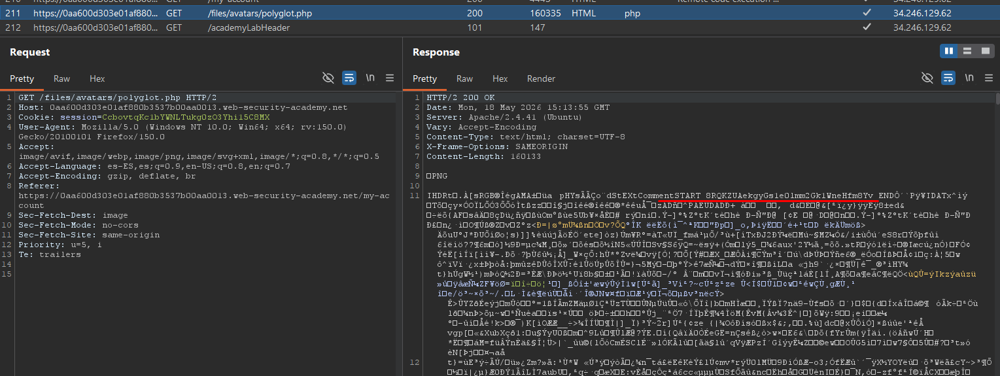

# Lab04: Remote code execution via polyglot web shell upload

This lab contains a vulnerable image upload function. Although it checks the contents of the file to verify that it is a genuine image, it is still possible to upload and execute server-side code.

To solve the lab, upload a basic PHP web shell, then use it to exfiltrate the contents of the file `/home/carlos/secret`. Submit this secret using the button provided in the lab banner.

You can log in to your own account using the following credentials: `wiener:peter`

Difficulty: Easy

Link: https://portswigger.net/web-security/learning-paths/file-upload-vulnerabilities/flawed-validation-of-the-file-s-contents/file-upload/lab-file-upload-remote-code-execution-via-polyglot-web-shell-upload#


## Summary

- [Introduction](#introduction)
- [Exploitation](#exploitation)
- [Impact](#impact)

## Introduction

This lab demonstrates an insecure file upload vulnerability that allows remote code execution through a polyglot file upload. The objective is to exploit weak validation mechanisms in the avatar upload functionality by bypassing file type restrictions and executing PHP code on the server. This type of vulnerability is relevant because it can lead to arbitrary code execution and full compromise of the application.

## Exploitation

First, I log in using the credentials provided by the lab and notice there is an image upload functionality used to configure the user avatar. From there, I try uploading a simple PHP script that I had already prepared from previous labs: 

```php id="byeyzx"
<?php echo file_get_contents('/home/carlos/secret'); ?>
```

However, when attempting to upload the `.php` file, the server returns an error message indicating that PHP files are not allowed and that only image formats are accepted.

This behavior suggests that the application performs validation based on the uploaded file extension or expected file type. To bypass this restriction, I use a tool called `exiftool`, which is capable of manipulating file metadata. The goal is to create a polyglot payload while preserving the structure and metadata of a legitimate image.

The process consists of copying all metadata from a regular image stored locally and injecting the malicious PHP code inside the image comment fields. After that, I generate a `.php` file containing the same metadata structure as a valid `.png` image, making the uploaded content appear legitimate to the server-side validation.



Once the manipulated file is created, I return to the avatar upload functionality and submit the crafted payload. This time, the server accepts the upload successfully.



After that, I identify the GET request responsible for returning the uploaded avatar image. By directly accessing this resource, the server interprets and executes the embedded PHP code contained in the polyglot file. As a result, I am able to retrieve the contents of `/home/carlos/secret`, successfully disclosing the password for the user `carlos` inside the image description/comment section.



## Impact

This vulnerability allows an attacker to execute arbitrary code on the server through the upload of seemingly legitimate files. By bypassing upload validation using a polyglot payload, a common image upload functionality can be turned into a Remote Code Execution (RCE) vector, potentially exposing sensitive application data and leading to full server compromise depending on the context of the exploitation.