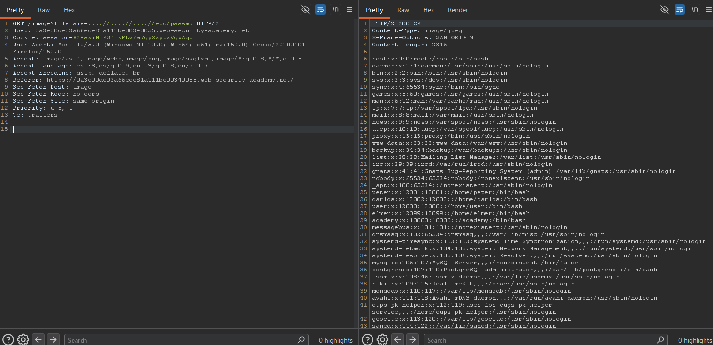

# Lab01: File path traversal, traversal sequences stripped non-recursively

Difficulty: Easy

Link: https://portswigger.net/web-security/learning-paths/path-traversal/common-obstacles-to-exploiting-path-traversal-vulnerabilities/file-path-traversal/lab-sequences-stripped-non-recursively

## Summary

- [Introduction](#introduction)
- [Exploitation](#exploitation)
- [Impact](#impact)

## Introduction

The goal of this lab was to exploit a Path Traversal vulnerability to access sensitive files stored on the server. The application used GET requests to load images, but the parameter responsible for the file path did not properly validate relative directory sequences. This type of vulnerability is relevant because it allows an attacker to access internal operating system files and expose confidential information directly from the server.

## Exploitation

This lab was surprisingly easy. The exploitation started from a GET request used by the website to load images. The request was intercepted and sent to Repeater, where the file path was manually modified to test a possible Path Traversal vulnerability.

In the parameter responsible for loading the image, the path to the /etc/passwd file was inserted, preceded by multiple `....//` sequences until the correct directory level in the server file system was reached.

`....//....//....//etc/passwd`

These sequences worked as a bypass for the application's filters, allowing traversal outside the expected directory and navigation through the operating system file structure. After adjusting the required number of relative directory sequences, the server successfully returned the contents of the /etc/passwd file.

This behavior confirmed that the application did not properly sanitize user-controlled file paths, allowing arbitrary access to internal system files. Once the correct path was identified, it was possible to access confidential information directly from the server.

## Impact

The Path Traversal vulnerability allows an attacker to access internal server files without authorization. In the context demonstrated in the lab, it was possible to read the /etc/passwd file, exposing sensitive operating system information. Depending on the environment configuration and available permissions, this type of issue can lead to the disclosure of credentials, configuration files, private keys, and other critical server data.