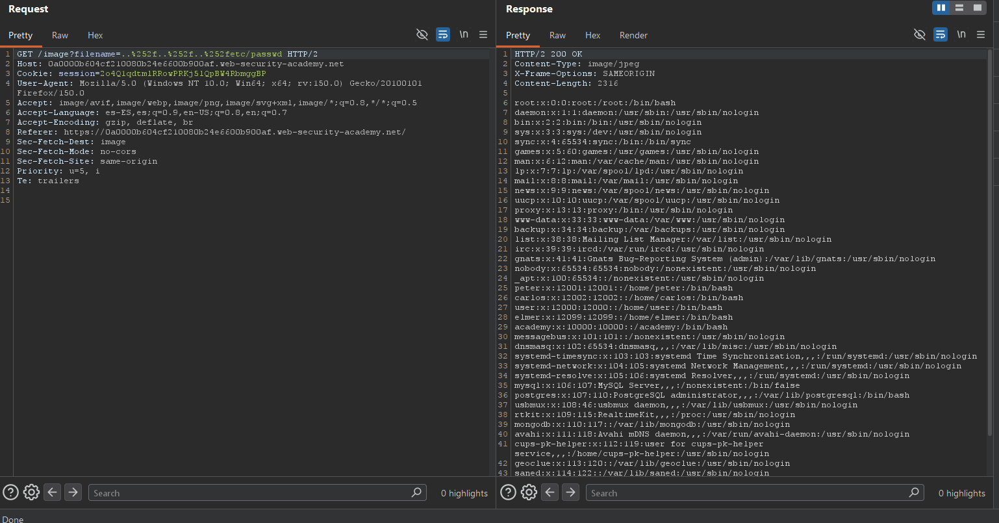

# Lab02: File path traversal, traversal sequences stripped with superfluous URL-decode

This lab contains a path traversal vulnerability in the display of product images.
The application blocks input containing path traversal sequences. It then performs a URL-decode of the input before using it.
To solve the lab, retrieve the contents of the `/etc/passwd` file.

Difficulty: Easy

Link: https://portswigger.net/web-security/learning-paths/path-traversal/common-obstacles-to-exploiting-path-traversal-vulnerabilities/file-path-traversal/lab-superfluous-url-decode

## Summary

- [Introduction](#introduction)
- [Exploitation](#exploitation)
- [Impact](#impact)

## Introduction

The goal of this lab was to exploit a Path Traversal vulnerability in the application's file loading mechanism. The system attempted to sanitize traversal sequences, but the validation was insufficient due to improper handling of URL encoding. This type of issue is relevant because it allows attackers to bypass application filters and access sensitive files directly from the server.

## Exploitation

In this lab, the exploitation started from a GET request used by the website itself to load images. The HTTP request was intercepted and sent to Repeater for manual manipulation of the parameters sent by the application.

The filename= parameter was modified with a payload using double URL encoding in order to bypass the sanitization mechanism implemented by the server.

`filename=..%252f..%252f..%252fetc/passwd`

The payload used `%252f`, which after the first decoding process became `%2f`, and was later interpreted as `/` by the application. This behavior allowed the traversal sequences to be reconstructed after the validation stage, effectively bypassing the sanitization mechanism implemented by the site.

After sending the modified request, the server successfully returned the contents of the `/etc/passwd` file, confirming that the filter did not properly handle double-encoded input. As a result, it was possible to access confidential information that should not have been exposed to the user.

## Impact

This vulnerability allows an attacker to bypass sanitization mechanisms implemented by the application and access internal server files through Path Traversal. In the lab scenario, it was possible to retrieve the contents of the `/etc/passwd` file, exposing sensitive operating system information. Depending on the available permissions and environment configuration, this type of issue can lead to the disclosure of credentials, configuration files, and other critical server data.