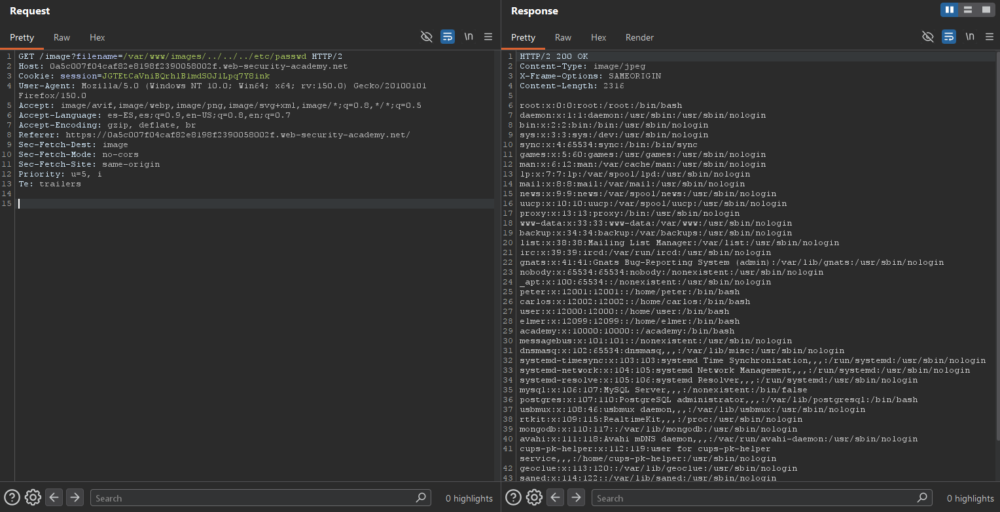

# Lab03: File path traversal, validation of start of path

This lab contains a path traversal vulnerability in the display of product images.
The application transmits the full file path via a request parameter, and validates that the supplied path starts with the expected folder.
To solve the lab, retrieve the contents of the `/etc/passwd` file.

Difficulty: Easy

Link: https://portswigger.net/web-security/learning-paths/path-traversal/common-obstacles-to-exploiting-path-traversal-vulnerabilities/file-path-traversal/lab-validate-start-of-path

## Summary

- [Introduction](#introduction)
- [Exploitation](#exploitation)
- [Impact](#impact)

## Introduction

The objective of this lab was to exploit a File Path Traversal vulnerability in an endpoint responsible for loading images from the server. The application performed a partial validation of the file path, checking only the beginning of the path provided in the filename parameter, which still allowed directory traversal sequences to be used. This type of vulnerability is relevant because it can allow unauthorized access to sensitive operating system files.

## Exploitation

The exploitation started from a regular request made by the lab website, identifying an endpoint that performed a GET request to load images. The HTTP request was sent to Repeater in order to manually manipulate the parameter responsible for the file path.

During the analysis, it was possible to observe that the endpoint already used the absolute path of the image on the server. This behavior raised the hypothesis that the application possibly validated only the beginning of the provided path, checking whether it started with the expected directory, but without properly handling traversal sequences that allowed navigation to parent directories.

Based on this hypothesis, the filename parameter was modified by adding `../` sequences after the original image path, attempting to escape the allowed directory until reaching sensitive files from the system.

After a few attempts, the following payload successfully accessed the `/etc/passwd` file: `filename=/var/www/images/../../../etc/passwd`

The response containing the file content confirmed that the application was vulnerable to File Path Traversal due to improper validation of the beginning of the path provided by the user.

## Impact

This vulnerability allows an attacker to access arbitrary files from the operating system by manipulating paths in application parameters. In the context of the lab, it was possible to access the `/etc/passwd` file, demonstrating that the application did not properly restrict access to the expected directory, which may result in exposure of sensitive information and assist further attacks against the server.