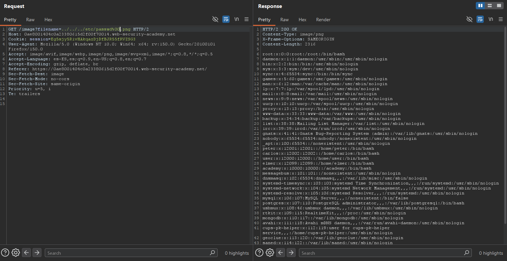

# Lab04: File path traversal, validation of file extension with null byte bypass

Difficulty: Easy

Link: https://portswigger.net/web-security/learning-paths/path-traversal/common-obstacles-to-exploiting-path-traversal-vulnerabilities/file-path-traversal/lab-validate-file-extension-null-byte-bypass

## Summary

- [Introduction](#introduction)
- [Exploitation](#exploitation)
- [Impact](#impact)

## Introduction

This lab explores a File Path Traversal vulnerability combined with a file extension validation bypass using null byte injection. The goal was to access sensitive system files by manipulating the parameter responsible for loading images in the application. This type of issue is relevant because legacy applications or native libraries that use null-terminated strings may interpret the `%00` character as the end of the string, ignoring the extension appended by the application.

## Exploitation

During the analysis of the application, a GET request responsible for loading images through the `filename` parameter was identified. The HTTP request was then sent to Repeater to make parameter manipulation easier and observe the application's behavior with different inputs.

The `filename` parameter originally pointed to a valid image file. The hypothesis was that the application performed some type of extension validation, allowing only files ending with `.png`, but without properly sanitizing path traversal sequences or null byte usage.

The payload used was: `filename=../../../etc/passwd%00.png`

The use of `../` allowed directory traversal until reaching the `/etc/passwd` file. The `%00` was used to terminate the string interpretation before the `.png` extension. In legacy applications or implementations using native C/C++ libraries, the null byte may be interpreted as the end of the string, causing the system to process only: `../../../etc/passwd` even if the application apparently validates or appends the `.png` extension.

After sending the modified request, the server returned the contents of the `/etc/passwd` file, confirming that the extension validation could be bypassed through null byte injection and that the application was vulnerable to File Path Traversal.

## Impact

This vulnerability allows an attacker to read arbitrary files from the operating system, including sensitive files containing users, credentials, configurations, or internal application information. When combined with additional weaknesses, exposure of these files may facilitate lateral movement, environment enumeration, and full server compromise.
