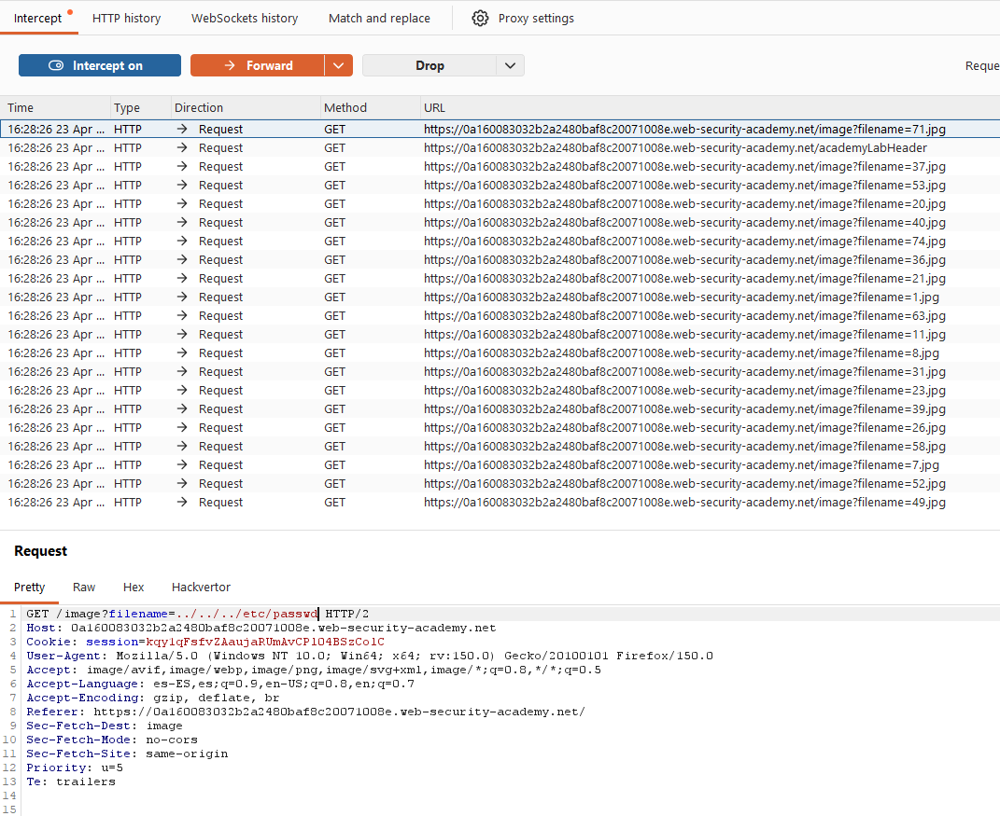
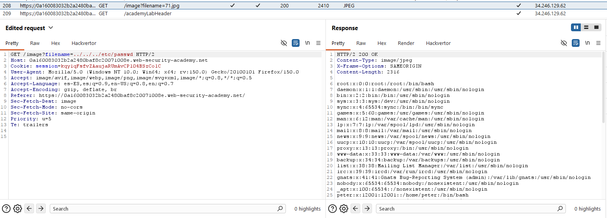

# Lab01: File path traversal, simple case

This lab contains a path traversal vulnerability in the display of product images.
To solve the lab, retrieve the contents of the `/etc/passwd` file.

Difficulty : Easy

Link: https://portswigger.net/web-security/learning-paths/server-side-vulnerabilities-apprentice/path-traversal-apprentice/file-path-traversal/lab-simple
## Summary

- [Introduction](#introduction)
- [Exploitation](#exploitation)
- [Impact](#impact)

## Introduction

This lab demonstrates a **path traversal** vulnerability in the product image display functionality, allowing arbitrary file access on the server. The exploitation is straightforward and consists of manipulating the image-loading parameter until it reaches the `/etc/passwd` file.

## Exploitation

By analyzing the site requests in Burp Suite, it is possible to identify an endpoint responsible for loading product images. The original request uses a `filename` parameter with what appears to be a legitimate image name.

`GET /image?filename=71.jpg`

With that in mind, the parameter was modified to attempt directory escape and reach a sensitive system file.

`GET /image?filename=../../../etc/passwd`

This change caused the server to return the contents of `/etc/passwd`, confirming the path traversal flaw and validating unauthorized access to the file.

After the parameter was changed, the application no longer rendered the image correctly, since the response contained text instead of a valid image file.

## Impact

This vulnerability enables arbitrary file read on the server, which may expose sensitive data, internal configuration, and information useful for environment enumeration. In the case of `/etc/passwd`, the attacker gets a clear proof of exploitation and can also gather details about users and system structure.