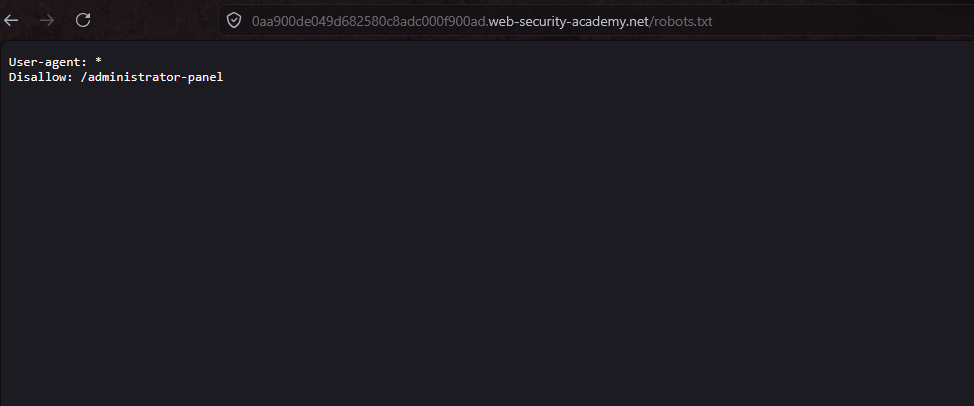

# Lab02: Unprotected admin functionality
This lab has an unprotected admin panel. 
Solve the lab by deleting the user `carlos`. 

Difficulty: Easy

Link: (colocar)

## Summary

- [Introduction](#introduction)
- [Exploitation](#exploitation)
- [Impact](#impact)

## Introduction

This lab explores an unprotected administrative functionality in a web application. The vulnerability allows unauthorized access to the admin panel due to its disclosure in a common file. It's relevant because it demonstrates how simple exposures can compromise critical access controls.

## Exploitation
Following the lab hint, the first test was to access the /robots.txt endpoint on the application URL. The file revealed the `/administrator-panel` path in the Disallow directive, confirming the existence of a hidden but unprotected admin panel.

Replacing the endpoint with `/administrator-panel`, the application redirected directly to the admin panel without requiring login or credentials. In the panel, it was possible to locate and delete the user carlos, achieving the lab objective.

This confirms the Broken Access Control vulnerability, as any anonymous visitor can manipulate sensitive administrative functions.

## Impact
The exposure of an unprotected admin panel allows unauthenticated attackers to delete users, alter data, or perform destructive actions, compromising the application's integrity and availability. In the demonstrated context, the arbitrary deletion of accounts like carlos illustrates the risk of data loss and service disruption for legitimate users.
