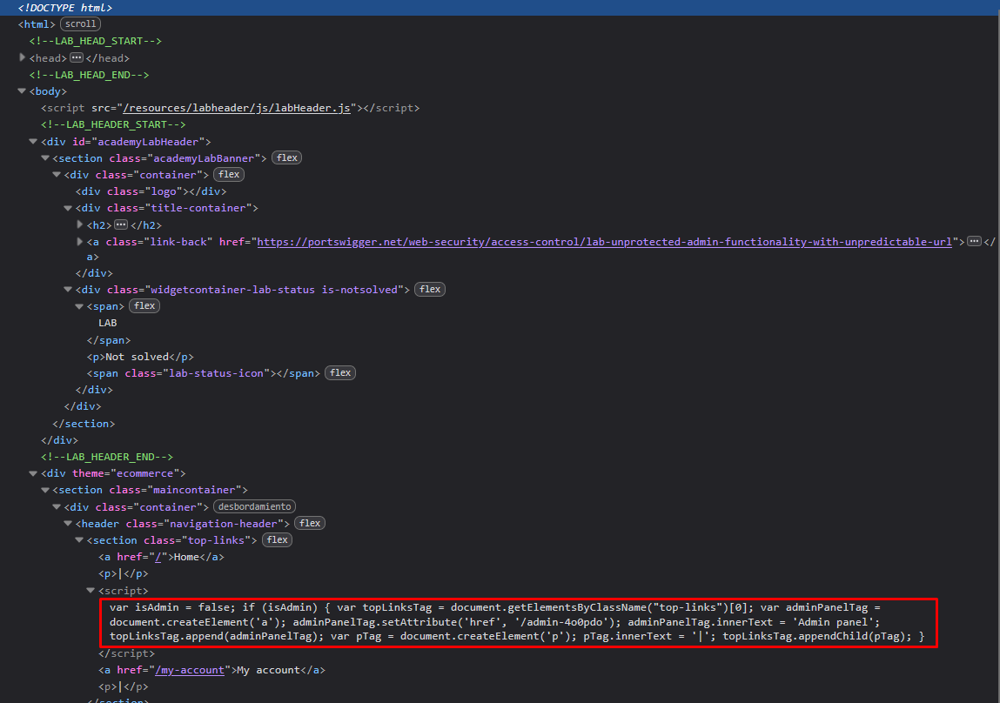
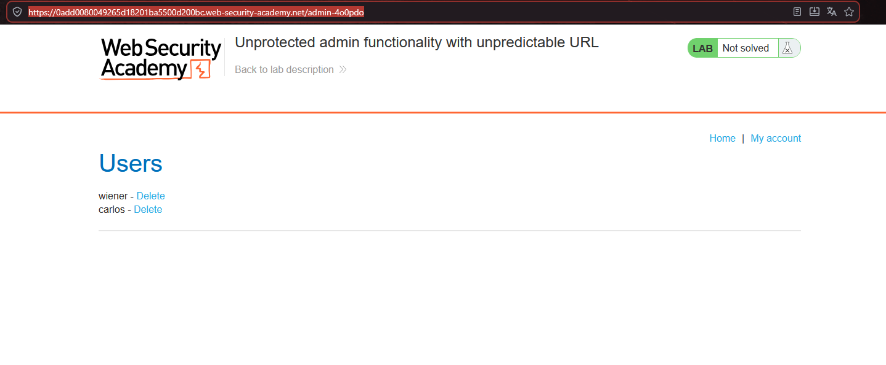

# Lab03: Unprotected admin functionality with unpredictable URL

This lab has an unprotected admin panel. It's located at an unpredictable location, but the location is disclosed somewhere in the application.
Solve the lab by accessing the admin panel, and using it to delete the user `carlos`.

Difficulty: Easy

Link: (colocar)

## Summary

- [Introduction](#introduction)
- [Exploitation](#exploitation)
- [Impact](#impact)

## Introduction

This lab explores an unprotected admin panel with an unpredictable URL, whose location is disclosed within the application itself. The vulnerability highlights the risk of "security by obscurity," where hidden paths lack proper authentication protection. It's relevant because it shows how basic source code inspection can expose critical access controls.

## Exploitation

This lab demonstrates a seemingly trivial flaw with potentially massive organizational risk. The approach was straightforward: right-click the page, select "Inspect," and navigate through the HTML body to locate a hidden link pointing directly to the admin panel.

`Endpoint discovered: /admin-4o0pdo`

Changing the endpoint to `/admin-4o0pdo` provided immediate, unrestricted access to the admin panel, allowing full user management capabilities, including deleting the target user carlos to complete the lab.

This confirms Broken Access Control, as anyone can discover admin functionality through basic client-side inspection.

## Impact

Exposing admin URLs in application HTML enables unauthorized access to privileged functionality. Attackers can perform arbitrary user management, like deleting accounts such as carlos, leading to data loss, legitimate user disruption, and complete platform integrity compromise.