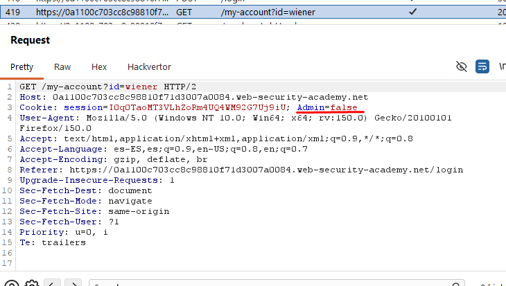

# Lab04: Access control enforced by a cookie

This lab has an admin panel at `/admin`, which identifies administrators using a forgeable cookie.
Solve the lab by accessing the admin panel and using it to delete the user `carlos`.
You can log in to your own account using the following credentials: `wiener:peter`

Difficulty: Easy

Link: (colocar)

## Summary

- [Introduction](#introduction)
- [Exploitation](#exploitation)
- [Impact](#impact)

## Introduction
This lab explores access control enforced solely by a cookie, where admin authorization is determined by a client-side manipulable parameter. The vulnerability enables privilege escalation via simple cookie modification. It's relevant as it demonstrates how easily client-side validations can be bypassed by attackers.

## Exploitation
First, accessing `/admin` returned the error "Admin interface only available if logged in as an administrator". Using the provided system credentials `(wiener:peter)`, logged in and noticed an interesting detail: the cookies contained `admin=false`.

`Cookie original: admin=false`

The next step was straightforward: logged out, activated Burp Suite Interceptor, and logged in again with the same credentials, but changed the parameter to `admin=true`. Sending the modified request granted full admin panel access.

`Cookie modified: admin=true`

To delete user carlos without the page resetting the cookie to false, kept the interceptor active, manually setting admin=true on every subsequent request.

## Impact
Authorization based on manipulable cookies allows regular users to escalate to admin privileges via simple interception. In the lab context, this enabled arbitrary account deletion like carlos, causing data loss and service disruption for legitimate application users.