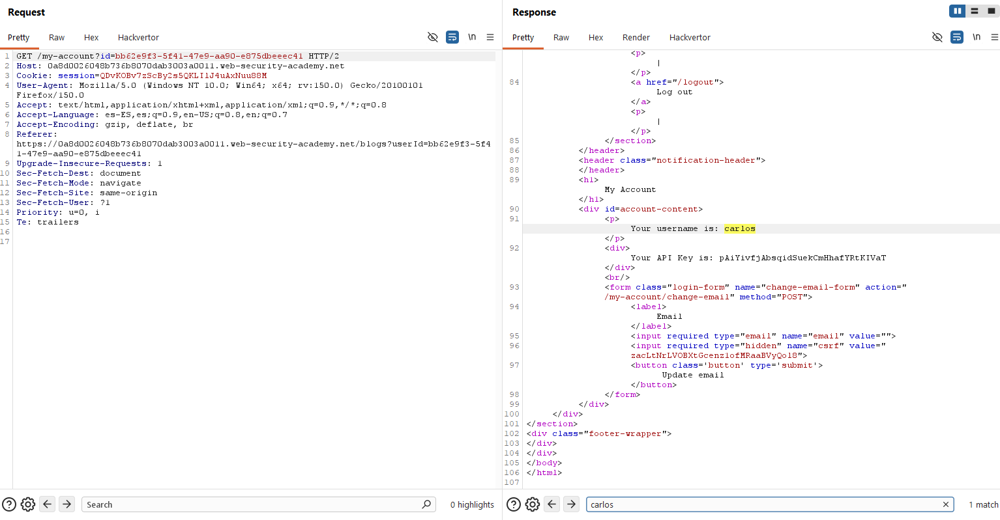

# Lab05: User ID controlled by request parameter, with unpredictable user IDs

This lab has a horizontal privilege escalation vulnerability on the user account page, but identifies users with GUIDs.
To solve the lab, find the GUID for `Carlos`, then submit his API key as the solution.
You can log in to your own account using the following credentials: `wiener:peter`

Difficulty: Easy

Link: https://portswigger.net/web-security/learning-paths/server-side-vulnerabilities-apprentice/access-control-apprentice/access-control/lab-user-id-controlled-by-request-parameter-with-unpredictable-user-ids

## Summary

- [Introduction](#introduction)
- [Exploitation](#exploitation)
- [Impact](#impact)

## Introduction
This lab explores access control where user ID is determined by a request parameter using unpredictable GUIDs. The vulnerability allows accessing other users' accounts by manipulating URL parameters. It's relevant as it demonstrates IDOR (Insecure Direct Object Reference) in modern apps with UUID identifiers.

## Exploitation
First logged in with provided credentials `(wiener:peter)` and checked "My Account" page. The URL exposed my GUID: `/my-account?id=6377b28d-174e-4f17-80ff-3cc6bcaaac22`. Screen showed username wiener and API Key.

`My GUID: 6377b28d-174e-4f17-80ff-3cc6bcaaac22`

Since it's a blog, searched for carlos posts. Post #2 listed Carlos as author, URL revealing his GUID: `/blogs?userId=bb62e9f3-5f41-47e9-aa90-e875dbeeec41.`

`Carlos GUID: bb62e9f3-5f41-47e9-aa90-e875dbeeec41`

With Burp Suite open, forwarded "My Account" request to Repeater and replaced my ID with Carlos: `/my-account?id=bb62e9f3-5f41-47e9-aa90-e875dbeeec41`. Response loaded Carlos's account without authentication, revealing username carlos and API Key `pAiYivfjAbsqidSuekCmHhafYRtKIVaT`.

Submitted the API Key to the available button to complete the lab.

## Impact
Manipulable user ID parameters let attackers access arbitrary accounts without credentials, exposing sensitive data like Carlos' API Key. This breaches confidentiality of critical information and enables further abuse such as unauthorized API usage or privilege escalation in integrated systems.