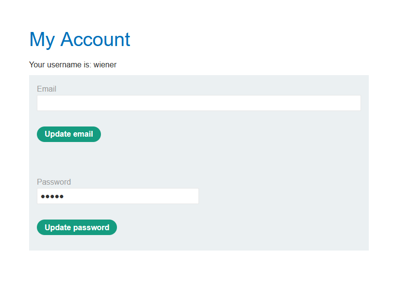
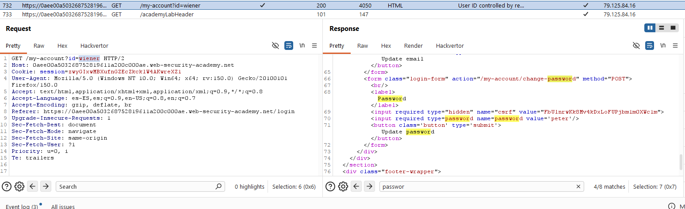
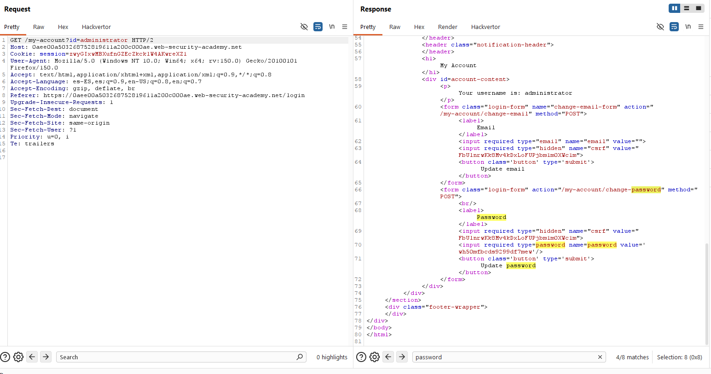

# Lab06: User ID controlled by request parameter with password disclosure

This lab has user account page that contains the current user's existing password, prefilled in a masked input.
To solve the lab, retrieve the administrator's password, then use it to delete the user `carlos`.
You can log in to your own account using the following credentials: `wiener:peter`

Difficulty: Easy

Link: https://portswigger.net/web-security/learning-paths/server-side-vulnerabilities-apprentice/access-control-apprentice/access-control/lab-user-id-controlled-by-request-parameter-with-password-disclosure

## Summary

- [Introduction](#introduction)
- [Exploitation](#exploitation)
- [Impact](#impact)

## Introduction

This lab explores IDOR where passwords are exposed in HTTP response bodies. The vulnerability allows credential recovery for other accounts by simply manipulating ID parameters. It's relevant because it shows how sensitive data in responses can compromise privileged accounts.

## Exploitation

First step is to log in with lab-provided credentials `(wiener:peter)` and immediately notice the pre-filled password field, masked visually.

Head to Burp Suite to analyze the API response and find my password in plain text within the HTTP response body (HTML content).

With this info available, send the same request to Burp Suite Repeater, change the id parameter to `administrator`, and check the response. Once the modified request is sent, the administrator's password appears in the HTTP response body (HTML content).

To conclude, access the account as administrator and delete user carlos.

## Impact

Password exposure in HTTP responses enables attackers to recover admin credentials through trivial IDOR manipulation. This grants full application control, allowing account deletions like carlos and complete platform security compromise.