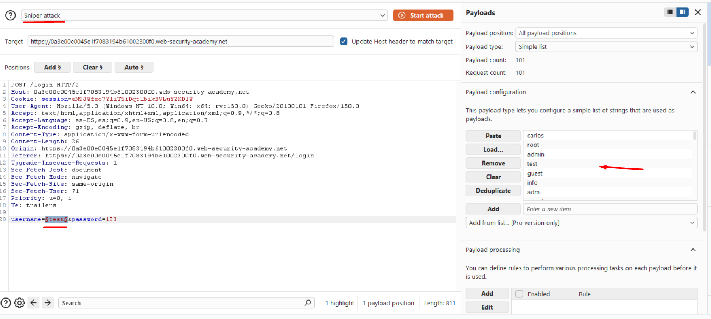
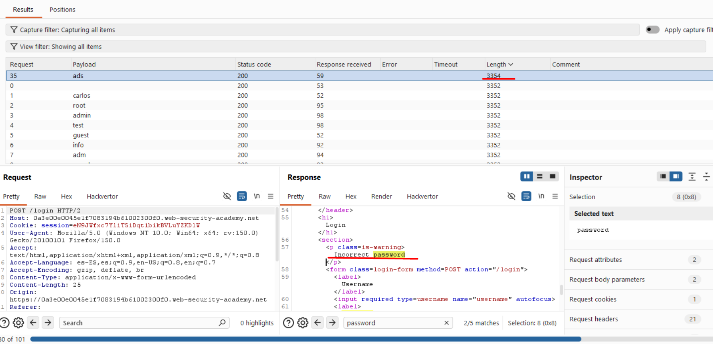
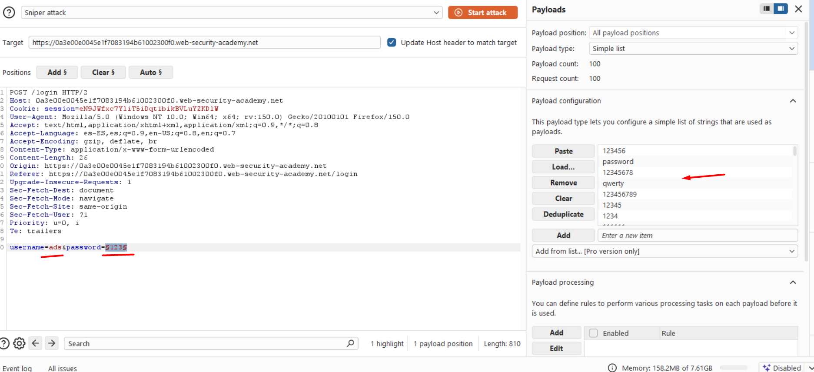

# Lab07: Username Enumeration via Different Responses

This lab is vulnerable to username enumeration and password brute-force attacks. It has an account with a predictable username and password, which can be found in the following wordlists:

- [Candidate usernames](https://portswigger.net/web-security/authentication/auth-lab-usernames)
- [Candidate passwords](https://portswigger.net/web-security/authentication/auth-lab-passwords)

To solve the lab, enumerate a valid username, brute-force this user's password, then access their account page.

Difficulty: Easy

Link: https://portswigger.net/web-security/learning-paths/server-side-vulnerabilities-apprentice/authentication-apprentice/authentication/password-based/lab-username-enumeration-via-different-responses#

## Summary

- [Introduction](#introduction)
- [Exploitation](#exploitation)
- [Impact](#impact)

## Introduction

This lab explores username enumeration through differentiated HTTP responses. The application leaks valuable information about valid users due to subtle variations in failed login responses. This is relevant because it demonstrates how authentication “oracles” can compromise the overall security of a system.

## Exploitation

The first step in this lab is to access the "My Account" section and attempt a login with random credentials, simply to analyze the request made by the API. In this case, the login attempt used `username=test` and `password=123` to capture the base request.

Once the request is intercepted, it is sent to Burp Suite Intruder, where a brute-force attack is configured to test multiple username and password combinations. Given that we have wordlists available, they are split into two files: `username.txt` and `passwords.txt.`

In Intruder, the Sniper attack is initially used to test usernames and then passwords (but Cluster Bomb could also be used to test all combinations simultaneously).

Intruder Configuration:
- Position 1: username= §test§ (wordlist: username.txt)
- Position 2: password= §123§ (wordlist: passwords.txt)

At this first step, the key observation is the response length. Only one response differs in size and returns "invalid password" in the body, while the others return a generic error. This indicates a valid username. The request corresponds to the user `ads`, confirming it as a valid account.

Next, the focus shifts to password brute-forcing. Using Burp Suite Intruder again, the username is fixed as ads, and the password field is set as the payload position with the passwords.txt wordlist.

After executing the attack, one response returns an HTTP 302 redirect, indicating a successful login. The correct credentials are ads:killer, successfully completing the lab.

## Impact

Different validation for username and password allows attackers to easily identify valid users. This significantly reduces the attack effort, as it removes the need to test all possible combinations. An attacker can first enumerate usernames and then focus only on passwords for confirmed accounts, making brute-force attacks far more efficient and increasing the risk of account compromise.