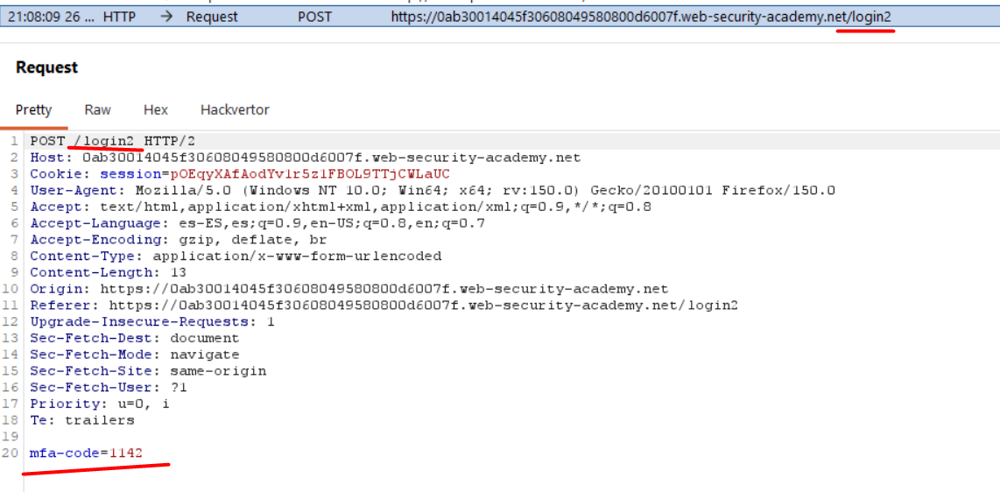
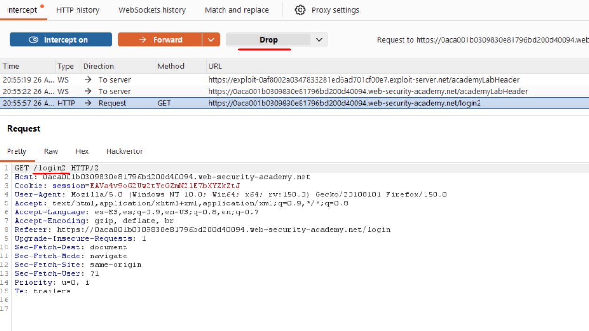

# Lab08: 2FA simple bypass

This lab's two-factor authentication can be bypassed. You have already obtained a valid username and password, but do not have access to the user's 2FA verification code. To solve the lab, access Carlos's account page.

- Your credentials: `wiener:peter`
- Victim's credentials `carlos:montoya`

Difficulty: Easy

Link: https://portswigger.net/web-security/learning-paths/server-side-vulnerabilities-apprentice/authentication-apprentice/authentication/multi-factor/lab-2fa-simple-bypass

## Summary

- [Introduction](#introduction)
- [Exploitation](#exploitation)
- [Impact](#impact)

## Introduction
The goal of this lab is to explore a logic vulnerability in the implementation of two-factor authentication (2FA). The system fails to ensure that the second factor of authentication is successfully verified before granting full access to the user's account, allowing the process to be bypassed through forced browsing.

## Exploitation
First, I logged into my own account to understand the authentication flow. Upon entering the credentials, I noticed that the application makes a POST login request, followed by a redirection to the 2FA verification endpoint, `/login2`. After successful verification, the user is redirected to '`/my-account?id=wiener`'.

Next, I initiated the exploitation against the victim's account `(carlos:montoya)`. With the Burp Suite interceptor active, I submitted the victim's credentials on the login page. When the request to the `/login2` endpoint was intercepted, I dropped the request to prevent the verification code from being processed or sent to the victim's email. 

After discarding this step, I manually manipulated the URL in the browser, changing it to:
`web-security-academy.net/my-account?id=carlos`

By directly accessing this URL, the server recognized my authenticated session (following the first step) and granted me access to the victim's dashboard, bypassing the absence of the authentication code.

## Impact
The vulnerability exposes user accounts to unauthorized access, allowing an attacker to completely bypass the 2FA security layer. This occurs because the server does not consistently validate whether the authentication process was fully completed, relying only on a partial session state that is incorrectly validated when accessing sensitive pages.