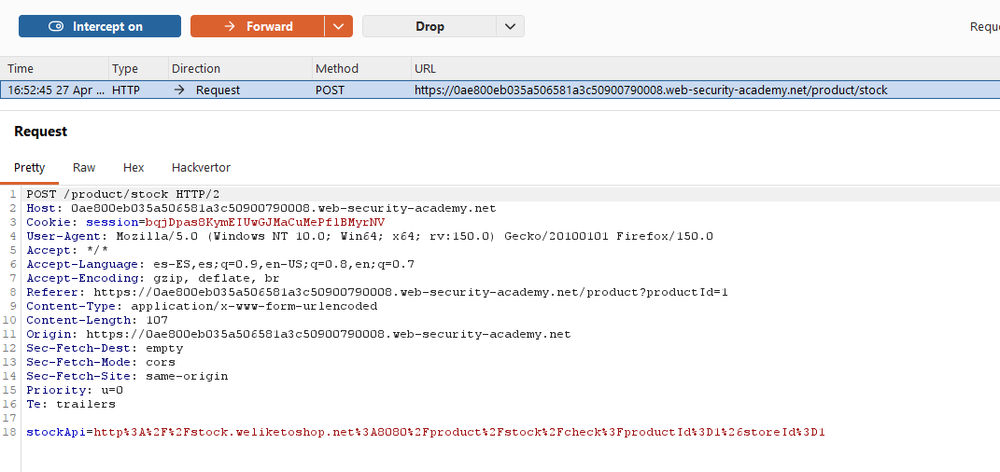
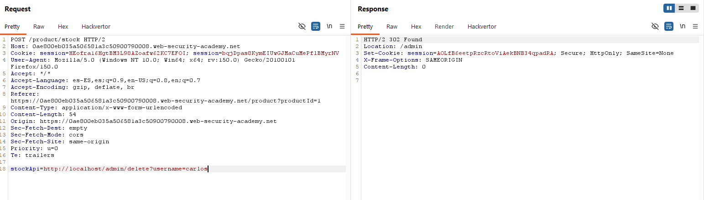

# Lab09: Basic SSRF against the local server

This lab has a stock check feature which fetches data from an internal system.
To solve the lab, change the stock check URL to access the admin interface at `http://localhost/admin` and delete the user `carlos`.

Difficulty: Easy

Link: https://portswigger.net/web-security/learning-paths/server-side-vulnerabilities-apprentice/ssrf-apprentice/ssrf/lab-basic-ssrf-against-localhost

## Summary

- [Introduction](#introduction)
- [Exploitation](#exploitation)
- [Impact](#impact)

## Introduction
This lab demonstrates a basic SSRF against the local server. The goal is to abuse the stock check functionality to make the backend access a protected internal endpoint, in this case, the admin panel at `http://localhost/admin`.

## Exploitation
First, I opened Burp Suite with the interceptor enabled and accessed a product to observe the stock check request. When clicking "check stock," the application sent a request containing the stockApi parameter, which was exactly the entry point to control the URL queried by the server.

With this, the hypothesis was clear: if I could change the stock URL to an internal address, the backend itself would make the request on my behalf. 

I then changed the stockApi value to `http://localhost/admin` and sent the request, which returned the admin panel and confirmed that the server was accessing internal resources without proper restriction.

By analyzing the HTML body of the response in Burp's history, I found the endpoint used to delete users in the administration: `http://localhost/admin/delete?username=carlos`. Then, I sent the request to the Repeater and replaced the stockApi parameter again with this full address, making the backend directly request the deletion action for user carlos.

`stockApi=http://localhost/admin/delete?username=carlos`

The result confirmed the exploitation: the request executed by the server reached the internal deletion endpoint and the user was deleted, completing the lab.

## Impact
The impact of this flaw is high because it allows an attacker to force the server to access internal resources that should not be exposed externally. In practice, this can reveal admin panel, allow sensitive actions such as deleting users, and, in real-world scenarios, pave the way for lateral movement within the network.