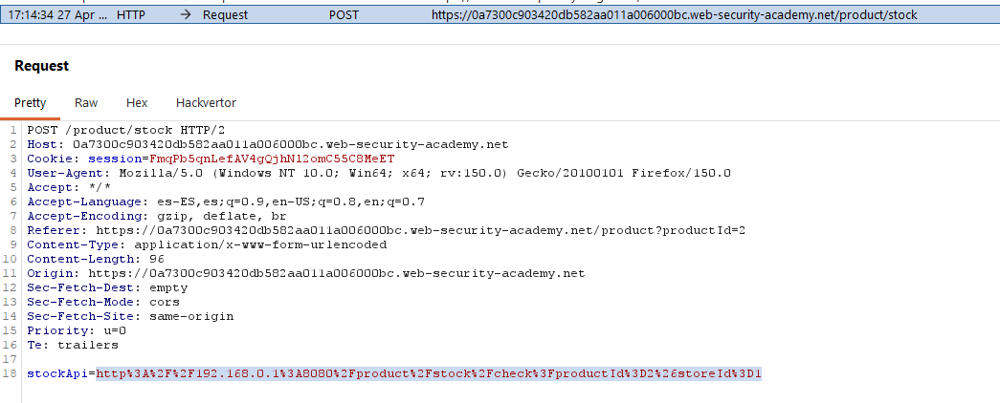
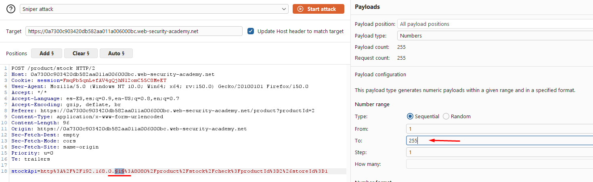
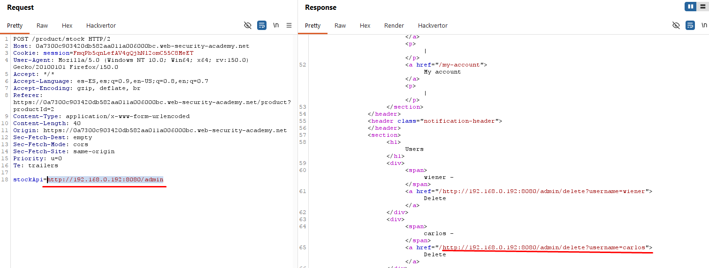

# Lab10: Basic SSRF against another back-end system

This lab has a stock check feature which fetches data from an internal system.
To solve the lab, use the stock check functionality to scan the internal `192.168.0.X` range for an admin interface on port `8080`, then use it to delete the user `carlos`.

Difficulty: Easy

Link: https://portswigger.net/web-security/learning-paths/server-side-vulnerabilities-apprentice/ssrf-apprentice/ssrf/lab-basic-ssrf-against-backend-system

## Summary

- [Introduction](#introduction)
- [Exploitation](#exploitation)
- [Impact](#impact)

## Introduction
This lab demonstrates an SSRF against another internal backend system. The goal is to discover the correct IP for the admin panel within the private `192.168.0.X` range and, from there, abuse the stockApi to access the admin panel and delete the user carlos.

## Exploitation
First, I opened Burp Suite with the interceptor enabled and accessed the first available product to observe the stock check functionality request. When clicking "check stock," the request was trapped in the interceptor and revealed that the stockApi parameter pointed to a private IP address, which indicated that the backend was querying an internal system controlled by the application.

At this point, the hypothesis was to explore variations of this IP to identify which internal host exposed the admin panel. I then sent the request to the Intruder and performed a sniper attack, changing the last octet of the address within the `192.168.0.X` range to test different destinations and observe which responses differed from the standard. 

After a few minutes, several 500 errors appeared, a 200 response as expected, and also a 404 for payload 192, with the message `"Not Found"` which confirmed that there was a useful response within the tested range.
With the correct IP identified, I sent the request to the Repeater and changed the stockApi to point directly to the admin panel on port 8080: `stockApi=http://192.168.0.192:8080/admin`

This gave me access to the admin panel and confirmed that the internal server was exposing the administrative area without proper restriction. By analyzing the HTML body of the response, I found the endpoint used to delete users, which already made visible the necessary action against carlos.
`/admin/delete?username=carlos`

Finally, I returned to the original request and replaced the value of the stockApi with the user deletion endpoint, maintaining the internal IP already discovered. The request was processed by the backend and the user carlos was deleted, completing the lab.

## Impact
The impact of this flaw is that an attacker can map internal services and reach a backend that should not be exposed publicly. When there is an admin panel accessible in this way, the SSRF can evolve from simple reading of internal responses to destructive actions, such as user deletion, compromising the system's integrity.