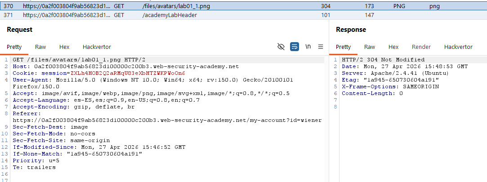

# Lab11: Remote code execution via web shell upload

This lab contains a vulnerable image upload function. It doesn't perform any validation on the files users upload before storing them on the server's filesystem.

To solve the lab, upload a basic PHP web shell and use it to exfiltrate the contents of the file `/home/carlos/secret`. Submit this secret using the button provided in the lab banner.

You can log in to your own account using the following credentials: `wiener:peter`

Difficulty: Easy

Link: https://portswigger.net/web-security/learning-paths/server-side-vulnerabilities-apprentice/file-upload-apprentice/file-upload/lab-file-upload-remote-code-execution-via-web-shell-upload

## Summary

- [Introduction](#introduction)
- [Exploitation](#exploitation)
- [Impact](#impact)

## Introduction
This lab addresses a critical file upload vulnerability where the application fails to perform any validation on the file type, content, or extension. The goal is to exploit this lack of restriction to upload a PHP web shell that will be executed by the server, allowing the reading of sensitive files such as the content of /home/carlos/secret.

## Exploitation
First, I logged into the application with the credentials wiener:peter and accessed the avatar upload functionality on the account configuration page. Upon uploading a common image and viewing the profile page, I observed in Burp Suite's history that the image was loaded via a GET request at the path `/files/avatars/<IMAGE-NAME>`, which indicated exactly where the uploaded files are stored by the server.

With this information, I created a simple PHP script named exploit.php to extract the content of the secret file:
`<?php echo file_get_contents('/home/carlos/secret'); ?>`

I submitted this file through the same avatar upload function. Since the system implemented no validation, the file was saved in the /files/avatars/ directory. To trigger the execution, I simply navigated to the URL where the file was stored and analyzed the HTTP request using Burp Suite:

`GET /files/avatars/exploit.php HTTP/1.1`

The server executed the PHP code and returned the content of the /home/carlos/secret file in the response body, confirming the remote code execution and completing the lab.

## Impact
The vulnerability of file uploads without proper validation allows an attacker to achieve remote code execution (RCE) on the web server. This totally compromises the application's security, allowing access to confidential data, file modification, alteration of the application's behavior, and, depending on the process permissions, can lead to total server compromise.
