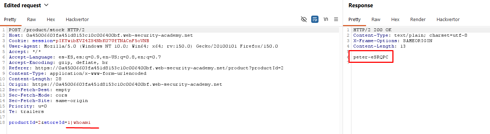

# Lab13: OS command injection, simple case

This lab contains an OS command injection vulnerability in the product stock checker.
The application executes a shell command containing user-supplied product and store IDs, and returns the raw output from the command in its response. To solve the lab, execute the `whoami` command to determine the name of the current user.

Difficulty: Easy

Link: https://portswigger.net/web-security/learning-paths/server-side-vulnerabilities-apprentice/os-command-injection-apprentice/os-command-injection/lab-simple

## Summary

- [Introduction](#introduction)
- [Exploitation](#exploitation)
- [Impact](#impact)

## Introduction
This lab contains an OS command injection vulnerability within the product stock checker. The application executes a shell command that incorporates user-supplied product and store IDs, returning the raw command output in the response, which allows for the execution of arbitrary commands on the server.

## Exploitation
With the lab open, I selected a product and accessed the "check stock" functionality. With Burp Suite intercepting the request, I observed that the POST request contained two main parameters: `productId` and `storeId`.

To test the vulnerability, I modified the value of the `storeId` parameter directly in the interceptor, adding a command separator character `(|)` followed by the whoami command. The `|` character instructs the shell to execute the command on the right after the original command: `storeId=1|whoami`

Upon forwarding this modified request, the application executed the injected command and returned the system user's name in the HTTP response body. This confirmed that the `storeId` parameter is vulnerable to command injection, and the execution of whoami completed the lab objective.

## Impact
OS command injection is a high-severity vulnerability that allows an attacker to execute arbitrary commands on the underlying operating system with the same privileges as the web application. This can lead to total server compromise, access to sensitive data, modification of configurations, and the use of the server to perform attacks against other systems on the internal network.