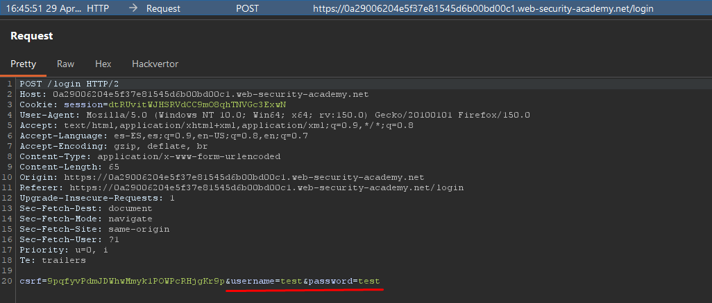

# Lab14: SQL injection vulnerability allowing login bypass

This lab contains a SQL injection vulnerability in the login function.
To solve the lab, perform a SQL injection attack that logs in to the application as the `administrator` user.

Difficulty: Easy

Link: https://portswigger.net/web-security/learning-paths/server-side-vulnerabilities-apprentice/sql-injection-apprentice/sql-injection/lab-login-bypass

## Summary

- [Introduction](#introduction)
- [Exploitation](#exploitation)
- [Impact](#impact)

## Introduction
This lab explores an SQL injection vulnerability in the login functionality. The goal is to manipulate the query used by the application to bypass password verification and authenticate directly as administrator.

## Exploitation
First, I went to My Account and made a login attempt with simple values, using test for both the username and password, just to capture the HTTP request and understand how the application sent these parameters. With Burp Suite open and the interceptor active, I received the request and confirmed that the body contained `username=test&password=test`.

From this, I tested the hypothesis that the username field was vulnerable to SQL injection. To do this, I changed the value to `administrator'--` and kept any value in the password field. The apostrophe closes the query string, and the `--` comments out the remainder of the SQL instruction, including the password check: `username=administrator'--&password=test`

Upon forwarding the modified request, the application accepted the authentication and granted me access to the administrator account, confirming that the query was successfully broken and that the login validation could be bypassed.

## Impact
The impact of this vulnerability is direct and severe because it allows an attacker to completely bypass the authentication process and take over a privileged account without knowing the password. In a real-world scenario, this can lead to full application compromise, especially when the accessed user holds administrative permissions.

